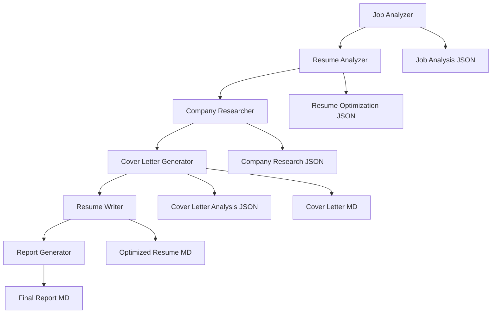

# Jobfull Resume Analyzer Documentation

## Overview

The Jobfull Resume Analyzer is a comprehensive AI-powered system built with CrewAI that optimizes resumes and job applications for 2025 ATS standards. The system employs 6 specialized AI agents working in a coordinated workflow to analyze job descriptions, optimize resumes, research companies, generate cover letters, and produce detailed career intelligence reports.

## 🎯 Key Features

- **ATS-Optimized Analysis**: Ensures compatibility with major ATS systems (Workday, Greenhouse, Lever, iCIMS)
- **2025 Industry Standards**: Incorporates latest AI detection prevention and formatting requirements
- **Comprehensive Intelligence**: Job analysis, company research, and competitive positioning
- **Visual Reporting**: Executive-level reports with Mermaid diagrams and interactive dashboards
- **Real Content Extraction**: Works with actual PDF resume content, no placeholders
- **Professional Deliverables**: Optimized resume, personalized cover letter, and intelligence reports

## 🏗️ System Architecture

The system consists of **6 AI agents** working through **7 sequential tasks**:

## 📚 Documentation Structure

### Core Documentation
- **[System Architecture](system-architecture.md)** - Complete system design and workflow
- **[Task Orchestration](task-orchestration.md)** - How tasks coordinate and share context
- **[Data Models](data-models.md)** - Pydantic models and data structures
- **[Configuration Guide](configuration-guide.md)** - Setup, configuration, and customization

### Agent Documentation
- **[Agent Overview](agents/README.md)** - Complete agent roles and capabilities
- **[Job Analyzer](agents/job-analyzer.md)** - ATS keyword extraction and scoring
- **[Resume Analyzer](agents/resume-analyzer.md)** - Format compliance and optimization
- **[Company Researcher](agents/company-researcher.md)** - Industry intelligence and research
- **[Cover Letter Generator](agents/cover-letter-generator.md)** - Personalized cover letter creation
- **[Resume Writer](agents/resume-writer.md)** - Content integration and optimization
- **[Report Generator](agents/report-generator.md)** - Visual analytics and reporting

### Usage & Implementation
- **[Usage Examples](usage-examples.md)** - How to run and customize the system
- **[Output Specifications](output-specifications.md)** - What the system produces
- **[Troubleshooting](troubleshooting.md)** - Common issues and solutions

## 🚀 Quick Start

1. **Prerequisites**: Python 3.8+, CrewAI, OpenAI API key
2. **Installation**: `pip install -r requirements.txt`
3. **Configuration**: Set up agents.yaml and tasks.yaml
4. **Run**: `python main.py` with job URL and company name

## 🎯 Primary Use Cases

- **ATS Rejection Issues**: Optimize resume format and keywords for ATS compatibility
- **Low Interview Callbacks**: Enhance content and improve job match scoring
- **Skill Gap Identification**: Detailed analysis of missing skills and requirements
- **Cover Letter Generation**: Professional, personalized cover letters with company research
- **Career Intelligence**: Comprehensive market analysis and strategic positioning

## 🔧 Technical Stack

- **AI Framework**: CrewAI with sequential processing
- **LLM**: GPT-4o-mini for all agents
- **Data Models**: Pydantic for structured output
- **Knowledge Sources**: PDF resume integration
- **Tools**: Web scraping, search, and research capabilities
- **Output Formats**: JSON analysis + Markdown deliverables

## 📊 Output Overview

The system produces:
- **7 JSON files**: Structured analysis data
- **3 Markdown files**: Professional deliverables (resume, cover letter, report)
- **Visual elements**: Mermaid diagrams, progress bars, interactive dashboards
- **ATS optimization**: Keyword integration and format compliance
- **Executive reporting**: Career intelligence with predictive analytics

---

For detailed information about any component, follow the links above to the specific documentation sections. 