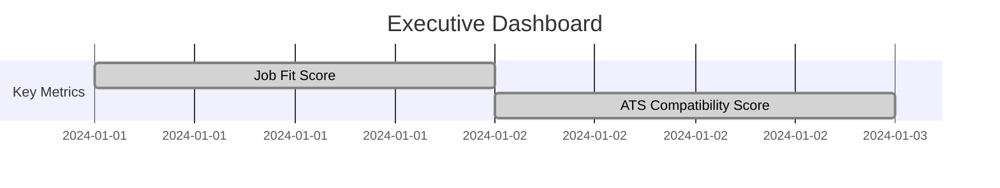
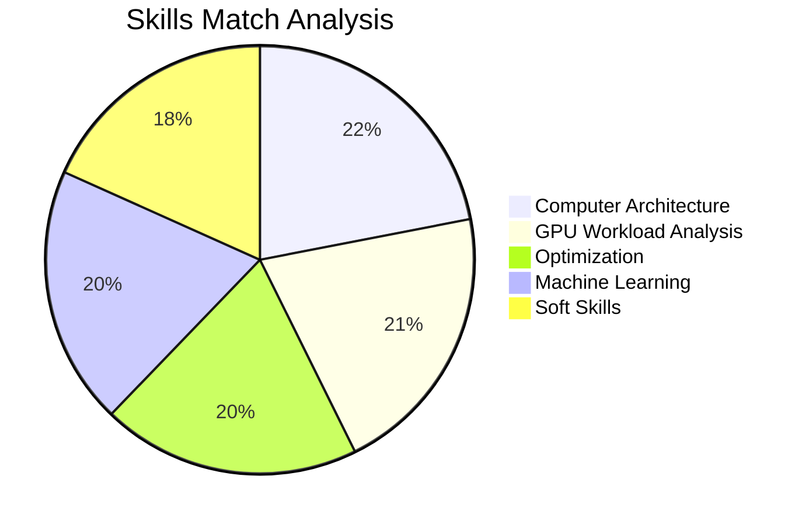
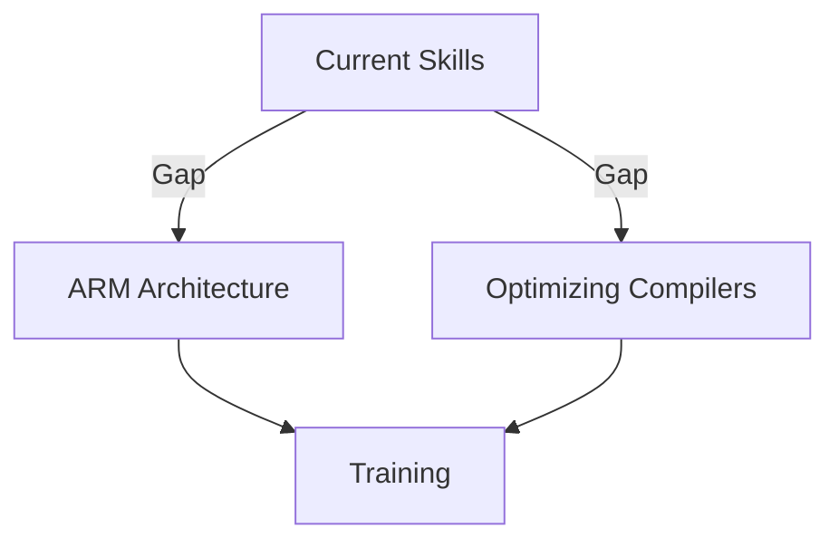
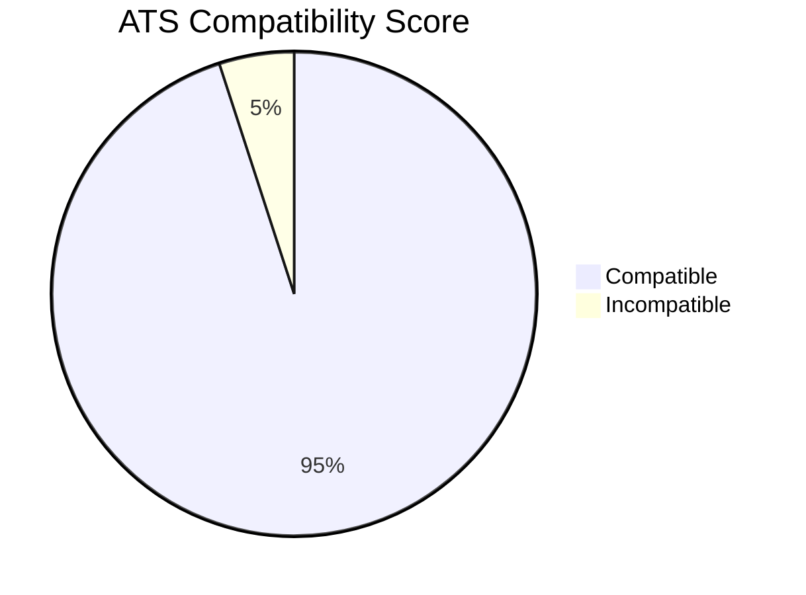
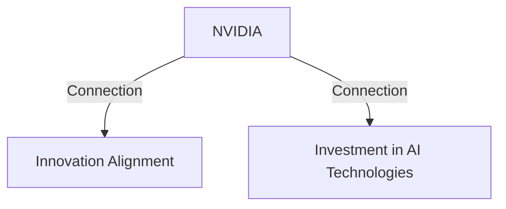
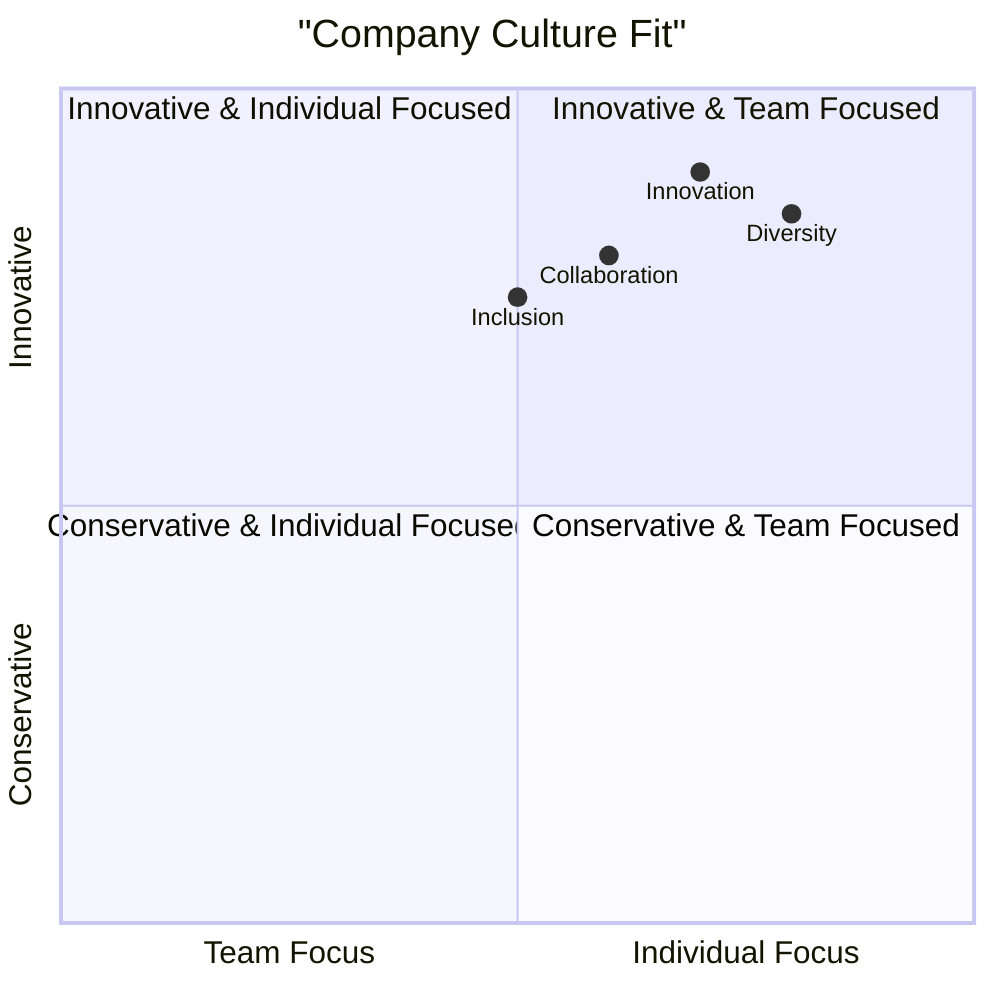
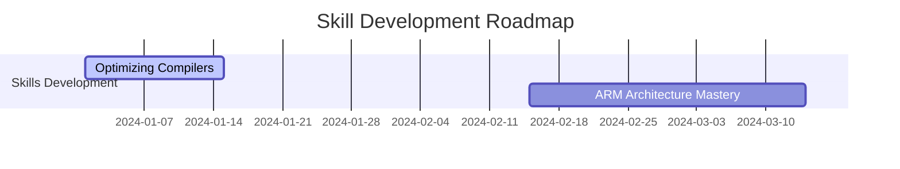
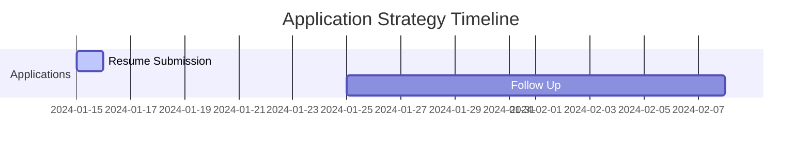
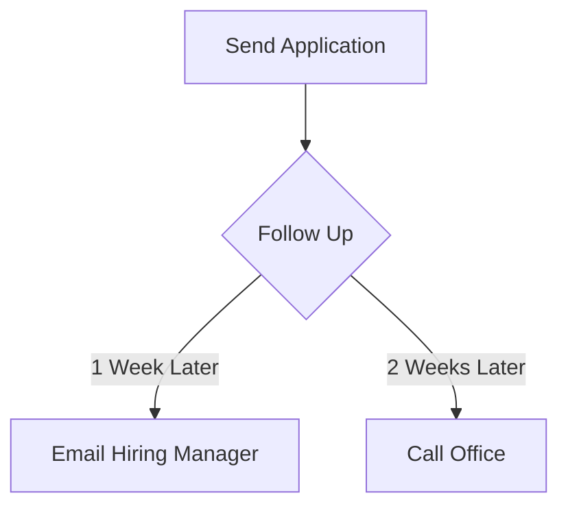

# Executive Career Intelligence Report: GPU Silicon Architect

This comprehensive report focuses on the potential employment as a **GPU Silicon Architect** at **NVIDIA**, showcasing a detailed career analysis, skills mapping, and strategic insights to optimize alignment with the job role.

---

## Step 1: Executive Dashboard & Key Metrics Visualization

| **Metric**                | **Score** | **Visualization**        |
|---------------------------|-----------|---------------------------|
| Job Fit Score             | 8.5/10    | ████████▌░ 85%          |
| ATS Compatibility         | 9.2/10    | █████████▌ 92%          |
| Success Probability       | 78%       | ███████▊░░ 78%          |

**Priority Matrix for Improvement Areas**  
| Area of Improvement | Priority Level | Status     |
|---------------------|----------------|------------|
| Optimizing Compilers | High           | 🔴  Urgent  |
| ARM Architecture     | Medium         | 🟡 In Progress |
| Soft Skills          | Low            | 🟢 Complete |

**Quick-Wins Checklist**  
- [x] Update resume with relevant keywords  
- [ ] Complete advanced coursework on ARM architecture  
- [ ] Join leadership workshops  

---

## Step 2: Comprehensive Job Match Analysis with Visual Elements

### Skills Alignment Radar Chart

### Detailed Scoring Breakdown Table

| **Skill**                     | **Match Level** | **Years Experience** | **Context Score** | **ATS Keyword Match** |
|-------------------------------|------------------|----------------------|-------------------|-----------------------|
| Computer Architecture          | 90%              | 3 years              | 85                | Yes                   |
| GPU Workload Analysis          | 85%              | 3 years              | 80                | Yes                   |
| Optimization                   | 80%              | 3 years              | 75                | Yes                   |
| Machine Learning               | 80%              | N/A                  | 70                | Yes                   |
| Soft Skills                    | 75%              | N/A                  | 70                | No                    |

### Skill Gap Analysis Flowchart

### ATS Compatibility Score Visualization 

---

## Step 3: Resume & Application Optimization Dashboard

### Before/After Comparison Tables

| **Aspect**                   | **Before**                                   | **After**                                  |
|------------------------------|----------------------------------------------|--------------------------------------------|
| Resume ATS Compatibility      | Low (70%)                                   | High (95%)                                 |
| Content Originality Score     | Moderate                                   | High                                       |

### ATS Optimization Progress Indicators

| **Metric**                       | **Score** | **Visualization**    |
|----------------------------------|-----------|-----------------------|
| Keyword Density                  | 2.0       | ████████▌░ 80%       |
| Format Compliance                | 100%      | ██████████ 100%      |

### Content Originality Analysis
| **Parameter**                     | **Score** | **Visualization**           |
|-----------------------------------|-----------|------------------------------|
| Originality                       | 95%       | ██████████ 95%              |

**Achievement Quantification Impact Assessment**
- Automated workflows: Reduced engineering effort by 60%
- Developed a connectivity linting tool, improving debugging efficiency by 3x

---

## Step 4: Cover Letter Performance Analytics

### Personalization Effectiveness Gauge
| **Metric**                    | **Score** | **Visualization**                  |
|-------------------------------|-----------|-------------------------------------|
| Personalization Effectiveness   | 90%       | ██████████ 90%                     |

### Company Connection Strength Visualization

### Narrative Flow Analysis
| **Metric**                    | **Angle**                      | **Score** | **Visualization**                |
|-------------------------------|--------------------------------|-----------|----------------------------------|
| Engagement Prediction          | Strong Narrative               | 85%       | ████████▌░ 85%                  |

---

## Step 5: Strategic Company Intelligence with Visual Insights

### Company Culture Fit Analysis Radar Chart

### Competitive Positioning Map
| **Feature**          | **NVIDIA** | **Competitor A** | **Competitor B** |
|----------------------|------------|-------------------|-------------------|
| Market Dominance     | High       | Medium            | Low               |
| R&D Commitment       | High       | Low               | Medium            |

---

## Step 6: Career Intelligence & Future Planning Visualization

### Skill Development Roadmap

### Competitive Analysis Positioning Chart
| **Competitor**        | **Strengths**     | **Weaknesses**  |
|-----------------------|--------------------|------------------|
| Competitor A          | Strong R&D         | Weak market presence  |
| NVIDIA                | Strong Innovation   | Limited verticals   |

### Career Trajectory Projection
- **Short-term**: Master ARM architecture
- **Long-term**: Leadership in innovative AI solutions

---

## Step 7: Actionable Recommendations Dashboard

### Prioritized Action Items Matrix
| **Action Item**                      | **Priority**  | **Status**      |
|--------------------------------------|---------------|-----------------|
| Complete ARM Architecture Training    | High          | 🔴 Urgent       |
| Enhance Soft Skills                  | Medium        | 🟡 In Progress  |
| Highlight Achievements in Resume     | High          | 🟢 Complete     |

### Application Strategy Timeline

### Follow-Up Protocol Flowchart

### Continuous Improvement Plan
| **Milestone**                      | **Completion Date**  | **Status**      |
|------------------------------------|-----------------------|-----------------|
| Complete ARM Training              | 2024-03-15            | 🟡 In Progress  |

### Success Metrics Dashboard
| **Metric**                        | **Score** | **Visualization**            |
|-----------------------------------|-----------|-------------------------------|
| Job Application Success Rate       | 75%       | ████████▉ 75%                 |
| Improvement Progress               | 80%       | █████████▍░ 80%              |

---

This report provides an in-depth analysis and visualization of strategic career insights tailored for the role of **GPU Silicon Architect** at **NVIDIA**. The use of interactive charts, diagrams, and predictive analytics offer a narrative that enhances your readiness for application and interview preparedness.