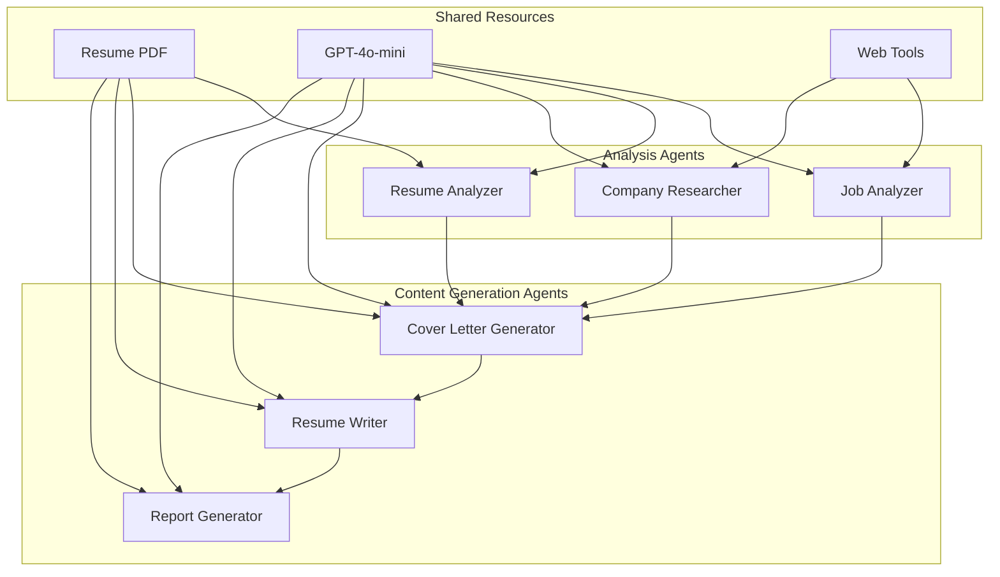

# Agent Documentation Overview

## System Agents

The Jobfull Resume Analyzer employs 6 specialized AI agents, each with distinct roles and capabilities designed for 2025 ATS optimization and career intelligence.

## 🤖 Agent Architecture



## 👥 Agent Profiles

### 1. [Job Analyzer](job-analyzer.md)
**Role**: ATS-Optimized Job Requirements Analyst  
**Primary Function**: Extract ATS keywords, analyze job requirements, and score candidate fit

**Key Capabilities:**
- ATS keyword extraction with importance weighting (1-5 scale)
- Industry trend analysis for 2025 standards
- Multi-dimensional candidate scoring (Technical: 35%, Soft: 20%, Experience: 25%, Education: 10%, Industry: 10%)
- Gap analysis and strategic recommendations

**Tools**: ScrapeWebsiteTool for job description extraction  
**Output**: `JobRequirements` model → `job_analysis.json`

### 2. [Resume Analyzer](resume-analyzer.md)
**Role**: ATS-Optimized Resume Expert & Format Compliance Specialist  
**Primary Function**: Analyze resume format, content originality, and ATS compatibility

**Key Capabilities:**
- ATS format compliance validation (single-column, standard fonts, no tables/images)
- Anti-AI detection and content originality assessment
- Keyword optimization strategy with natural integration
- Section-specific improvement recommendations

**Knowledge Source**: Resume PDF  
**Output**: `ResumeOptimization` model → `resume_optimization.json`

### 3. [Company Researcher](company-researcher.md)
**Role**: 2025 Industry Intelligence & Company Research Specialist  
**Primary Function**: Comprehensive company analysis and market intelligence

**Key Capabilities:**
- Industry trend analysis and competitive positioning
- Company culture and interview preparation insights
- Leadership analysis and organizational intelligence
- Strategic application insights and talking points

**Tools**: SerperDevTool for web search  
**Output**: `CompanyResearch` model → `company_research.json`

### 4. [Cover Letter Generator](cover-letter-generator.md)
**Role**: ATS-Optimized Cover Letter Specialist & Personal Branding Expert  
**Primary Function**: Generate personalized, professional cover letters

**Key Capabilities:**
- Real contact information extraction from PDF
- Achievement-focused narrative development
- Company-specific personalization and value proposition
- Professional business letter formatting with today's date

**Knowledge Source**: Resume PDF  
**Output**: `CoverLetterGeneration` model → `cover_letter_analysis.json` + `cover_letter.md`

### 5. [Resume Writer](resume-writer.md)
**Role**: Resume Content Integration & Optimization Specialist  
**Primary Function**: Create optimized resume using real candidate content

**Key Capabilities:**
- Authentic content extraction from PDF (no placeholders)
- Optimization recommendation implementation
- ATS keyword integration with natural voice preservation
- Professional markdown formatting with compliance

**Knowledge Source**: Resume PDF  
**Output**: Markdown → `optimized_resume.md`

### 6. [Report Generator](report-generator.md)
**Role**: Executive Analytics, Data Visualization & Career Intelligence Specialist  
**Primary Function**: Create comprehensive visual reports with analytics

**Key Capabilities:**
- Mermaid diagram creation (pie charts, gantt charts, flowcharts)
- Unicode progress bar visualization (████████▌░ 85%)
- Interactive dashboard elements with priority matrices
- Predictive analytics and strategic career planning

**Knowledge Source**: Resume PDF  
**Output**: Markdown → `final_report.md`

## 🔧 Technical Specifications

### Common Configuration
- **LLM**: GPT-4o-mini for all agents
- **Framework**: CrewAI with sequential processing
- **Verbose Mode**: Enabled for detailed logging
- **Output Format**: Structured Pydantic models + file outputs

### Knowledge Source Integration
```python
# Resume PDF available to content-generation agents
knowledge_sources=[self.resume_pdf]
```

### Tool Integration
```python
# Job Analyzer
tools=[ScrapeWebsiteTool()]

# Company Researcher  
tools=[SerperDevTool()]

# Other agents use PDF knowledge source
```

## 🎯 Agent Specialization Matrix

| Agent | ATS Focus | Content Creation | Research | Analytics | PDF Access |
|-------|-----------|------------------|----------|-----------|------------|
| Job Analyzer | ✅ Primary | ❌ | ✅ Web | ✅ Scoring | ❌ |
| Resume Analyzer | ✅ Primary | ❌ | ❌ | ✅ Gap Analysis | ✅ |
| Company Researcher | ❌ | ❌ | ✅ Primary | ✅ Intelligence | ✅ |
| Cover Letter Generator | ✅ Secondary | ✅ Primary | ❌ | ❌ | ✅ |
| Resume Writer | ✅ Secondary | ✅ Primary | ❌ | ❌ | ✅ |
| Report Generator | ❌ | ✅ Visualization | ❌ | ✅ Primary | ✅ |

## 🔄 Agent Interaction Flow

### Context Dependency Chain
1. **Job Analyzer** → Establishes baseline requirements and ATS keywords
2. **Resume Analyzer** → Builds on job analysis for gap identification
3. **Company Researcher** → Uses both previous analyses for targeted research
4. **Cover Letter Generator** → Synthesizes all analysis for personalization
5. **Resume Writer** → Applies optimizations with full context
6. **Report Generator** → Consolidates all data for executive reporting

### Data Sharing Mechanism
- **Sequential Processing**: Each agent receives outputs from previous agents
- **JSON Context**: Structured data passed between tasks
- **PDF Knowledge**: Shared resume content across relevant agents
- **External Tools**: Web scraping and search capabilities

## 📊 Quality Assurance

### ATS Compliance Standards
- **Format Validation**: Single-column layouts, standard fonts, no graphics
- **Keyword Integration**: Natural language processing without stuffing
- **System Compatibility**: Workday, Greenhouse, Lever, iCIMS optimization

### Content Quality Controls
- **Authenticity**: Real content extraction, no AI-generated placeholders
- **Originality**: Anti-AI detection and template avoidance
- **Professional Standards**: Executive-level deliverable quality

### Performance Optimization
- **Resource Efficiency**: Minimal API calls with maximum intelligence
- **Context Reuse**: Shared knowledge sources and cumulative learning
- **Error Handling**: Graceful degradation and validation checks

---

Each agent is designed as a specialist in their domain while contributing to the overall objective of creating optimized, ATS-compliant job application materials that maximize interview callback potential. 