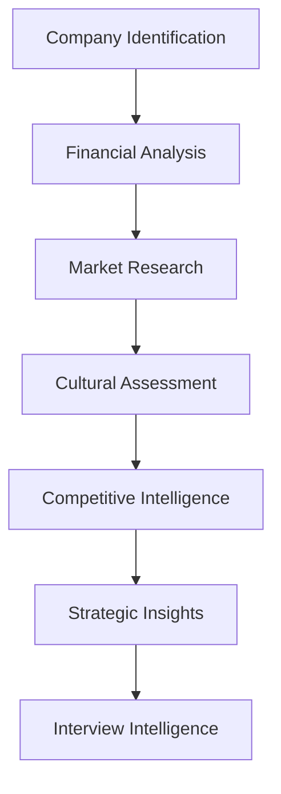

# Company Researcher Agent

## 🎯 Agent Overview

The **Company Researcher** is a specialized intelligence-gathering AI agent that provides comprehensive company analysis, market insights, and competitive intelligence. This agent focuses on 2025 industry trends, company culture analysis, and strategic business intelligence to enhance job applications and interview preparation.

## 🏷️ Agent Identity

- **Role**: 2025 Industry Intelligence & Company Research Specialist
- **Goal**: Provide comprehensive company analysis with 2025 market trends, competitive insights, and interview intelligence
- **Position**: Agent 3 of 6 in the sequential workflow
- **Dependencies**: Receives input from Resume Analyzer Agent
- **Outputs to**: Cover Letter Generator Agent

## 🧠 Agent Expertise

### Primary Specializations
- **Industry Intelligence**: Deep understanding of 2025 market trends and dynamics
- **Company Analysis**: Comprehensive organizational research and insights
- **Competitive Landscape**: Market positioning and competitor analysis
- **Cultural Intelligence**: Workplace culture and values assessment
- **Strategic Insights**: Business positioning and growth opportunities

### Research Competencies
- Leadership change analysis and impact assessment
- Digital transformation initiatives tracking
- Sustainability and ESG program evaluation
- Remote work policy and culture adaptation
- AI adoption strategies and implementation
- Market expansion and growth initiatives

## 📋 Core Responsibilities

### 1. Company Profile Analysis
```
🏢 Company Intelligence Score: [0-100]
├── Financial Health (25%)
├── Market Position (25%)
├── Culture & Values (25%)
└── Growth Trajectory (25%)
```

### 2. Market & Industry Research
- **Industry Trends**: 2025 sector-specific developments
- **Competitive Analysis**: Market positioning and differentiation
- **Technology Adoption**: AI, automation, and digital initiatives
- **Regulatory Environment**: Compliance and industry standards
- **Economic Factors**: Market conditions affecting the company

### 3. Organizational Intelligence
- **Leadership Analysis**: Executive team and management structure
- **Company Culture**: Values, mission, and workplace environment
- **Employee Experience**: Glassdoor insights and employee sentiment
- **Recent Developments**: News, partnerships, and strategic changes
- **Growth Initiatives**: Expansion plans and investment areas

### 4. Interview Preparation Intelligence
- **Interview Process Insights**: Common questions and assessment methods
- **Hiring Priorities**: Current recruitment focus and skill demands
- **Company Challenges**: Strategic issues candidates can address
- **Value Propositions**: How candidates can contribute to company goals

## 🔄 Agent Workflow

### Research Framework


### Research Process

#### Phase 1: Foundational Research (45 seconds)
1. **Company Profile Building**
   - Basic company information and structure
   - Financial health and performance metrics
   - Business model and revenue streams

2. **Industry Context Analysis**
   - Market size and growth trends
   - Competitive landscape mapping
   - Industry challenges and opportunities

#### Phase 2: Deep Intelligence Gathering (60 seconds)
3. **Leadership & Culture Research**
   - Executive team analysis and backgrounds
   - Company values and cultural indicators
   - Employee satisfaction and retention data

4. **Strategic Position Assessment**
   - Market positioning and differentiation
   - Recent strategic initiatives and investments
   - Partnership and acquisition activity

#### Phase 3: Actionable Insights Generation (45 seconds)
5. **Interview Preparation Intelligence**
   - Company-specific talking points
   - Strategic challenges candidates can address
   - Cultural fit indicators and preparation tips

## 📊 Output Specifications

### JSON Output Structure
```json
{
  "company_research": {
    "company_overview": {
      "name": "TechCorp Inc.",
      "industry": "Software Technology",
      "size": "1000-5000 employees",
      "founded": 2010,
      "headquarters": "San Francisco, CA",
      "financial_health_score": 88
    },
    "market_analysis": {
      "market_position": "Industry Leader",
      "competitive_advantages": ["AI Innovation", "Market Share", "Talent"],
      "industry_growth_rate": 15.2,
      "market_challenges": ["Regulatory Changes", "Competition"]
    },
    "culture_intelligence": {
      "company_values": ["Innovation", "Collaboration", "Diversity"],
      "work_environment": "Hybrid Remote",
      "employee_satisfaction": 4.2,
      "glassdoor_rating": 4.1,
      "culture_keywords": ["fast-paced", "innovative", "collaborative"]
    },
    "recent_developments": [
      {
        "date": "2024-11",
        "type": "product_launch",
        "description": "AI-powered analytics platform",
        "impact": "Revenue growth opportunity"
      }
    ],
    "strategic_insights": {
      "growth_areas": ["AI/ML", "International Expansion", "Enterprise Sales"],
      "challenges": ["Talent Acquisition", "Market Competition"],
      "investment_priorities": ["R&D", "Talent", "Infrastructure"]
    },
    "interview_intelligence": {
      "common_questions": ["Tell me about your AI experience", "How do you handle ambiguity?"],
      "hiring_priorities": ["Technical Skills", "Cultural Fit", "Growth Mindset"],
      "talking_points": ["AI innovation", "Market expansion", "Team collaboration"]
    }
  }
}
```

### Key Research Deliverables
- **Company Profile** with financial and operational metrics
- **Market Analysis** including competitive positioning
- **Cultural Intelligence** for interview and application strategy
- **Strategic Insights** for value proposition development
- **Interview Preparation** with company-specific intelligence

## 🚀 2025 Industry Focus Areas

### Technology Transformation
- **AI & Automation**: Company AI adoption strategies and implementation
- **Cloud Migration**: Infrastructure modernization initiatives
- **Cybersecurity**: Security posture and investment priorities
- **Data Analytics**: Business intelligence and data-driven decision making

### Sustainability & ESG
- **Environmental Initiatives**: Carbon neutrality and sustainability programs
- **Social Responsibility**: Community engagement and social impact
- **Governance**: Leadership diversity and corporate governance practices
- **Stakeholder Capitalism**: Balanced stakeholder value creation

### Workplace Evolution
- **Remote Work Policies**: Hybrid and distributed work strategies
- **Employee Experience**: Culture, benefits, and engagement programs
- **Diversity & Inclusion**: DEI initiatives and progress metrics
- **Learning & Development**: Upskilling and career development programs

## 🔗 Agent Integration

### Input Dependencies
- **Job Analysis Results** for role-specific research focus
- **Resume Analysis** for candidate-company alignment assessment
- **Industry Context** from job requirements analysis
- **Company Information** provided by user input

### Output Utilization
- **Cover Letter Generator** uses cultural and strategic insights
- **Resume Writer** incorporates company-specific keywords and values
- **Report Generator** includes company intelligence in recommendations
- **Interview Preparation** enhanced with company-specific intelligence

## 📈 Research Quality Metrics

### Intelligence Depth Indicators
- **Information Completeness**: >90% of key data points collected
- **Source Reliability**: Multiple verified sources for critical insights
- **Timeliness**: <6 months old for strategic and financial data
- **Relevance Score**: >85% alignment with job requirements

### Strategic Value Assessment
- **Actionability**: Insights directly applicable to application strategy
- **Competitive Advantage**: Unique intelligence not widely available
- **Cultural Alignment**: Clear culture-candidate fit indicators
- **Interview Readiness**: Comprehensive preparation intelligence

## 🛠️ Configuration Options

### Research Focus Settings
```yaml
company_researcher:
  research_depth: "comprehensive"  # basic, standard, comprehensive
  industry_focus: "auto"  # auto, tech, finance, healthcare, etc.
  cultural_emphasis: "high"  # low, medium, high
  competitive_analysis: "enabled"  # enabled, disabled
  financial_analysis: "public_only"  # public_only, all_available
```

### Industry-Specific Research
- **Technology**: Technical innovation, R&D, talent acquisition focus
- **Healthcare**: Regulatory compliance, patient outcomes, clinical research
- **Finance**: Regulatory environment, fintech adoption, risk management
- **Manufacturing**: Supply chain, sustainability, automation initiatives

## 🔍 Research Sources & Methods

### Primary Intelligence Sources
- **Financial Reports**: 10-K, 10-Q, annual reports, investor presentations
- **News & Media**: Press releases, industry publications, analyst reports
- **Employee Insights**: Glassdoor, LinkedIn, company career pages
- **Social Intelligence**: Executive LinkedIn profiles, company social media
- **Industry Analysis**: Market research reports, competitive intelligence

### Research Validation
- **Multi-Source Verification**: Cross-referencing information across sources
- **Recency Validation**: Ensuring information currency and relevance
- **Bias Detection**: Identifying and accounting for source bias
- **Fact Checking**: Verifying claims and assertions

## 🔧 Troubleshooting

### Common Research Challenges
1. **Limited Public Information** → Focus on available sources and industry benchmarks
2. **Outdated Data** → Emphasize most recent available information and trends
3. **Conflicting Sources** → Provide balanced perspective with source attribution
4. **Private Company Research** → Leverage industry analysis and comparative data

### Research Enhancement Tips
- Combine multiple intelligence sources for comprehensive view
- Focus on recent developments and strategic initiatives
- Emphasize cultural and values alignment opportunities
- Include competitive differentiation insights

---

*The Company Researcher Agent provides strategic business intelligence and cultural insights that transform job applications from generic submissions into targeted, informed engagement strategies.* 