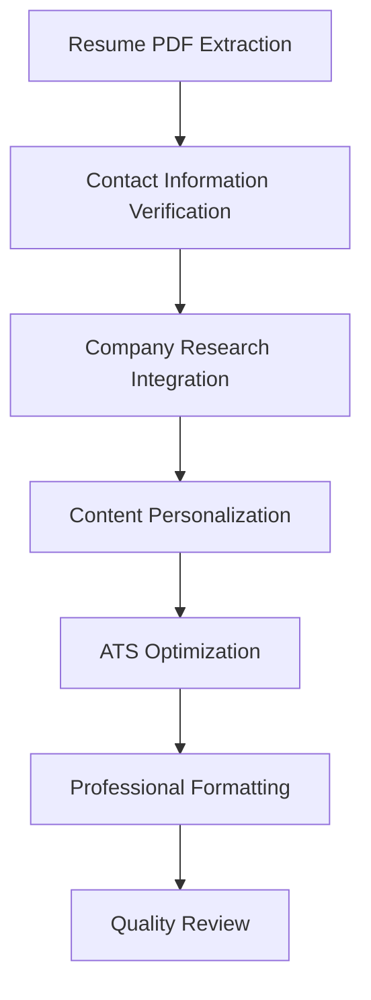

# Cover Letter Generator Agent

## 🎯 Agent Overview

The **Cover Letter Generator** is a specialized personal branding and professional correspondence AI agent that creates compelling, personalized cover letters using actual candidate information. This agent excels at extracting real contact details from resume PDFs and crafting authentic, ATS-optimized cover letters that engage both ATS systems and hiring managers.

## 🏷️ Agent Identity

- **Role**: ATS-Optimized Cover Letter Specialist & Personal Branding Expert
- **Goal**: Generate compelling, personalized cover letters with actual contact information, today's date, and professional formatting that pass ATS screening and engage hiring managers
- **Position**: Agent 4 of 6 in the sequential workflow
- **Dependencies**: Receives input from Company Researcher Agent
- **Outputs to**: Resume Writer Agent

## 🧠 Agent Expertise

### Primary Specializations
- **Personal Branding**: Expert in authentic professional storytelling and value proposition
- **ATS Optimization**: Creating cover letters that pass modern ATS filtering systems
- **Business Correspondence**: Professional formatting and business letter standards
- **Content Personalization**: Tailoring messaging to specific companies and roles
- **Authentic Voice**: Maintaining candidate's professional identity and communication style

### Technical Competencies
- Real candidate information extraction from PDF sources
- Professional business letter formatting with proper headers
- Strategic keyword integration for ATS compatibility
- Cultural fit messaging and company research integration
- Achievement-focused storytelling with quantifiable results

## 📋 Core Responsibilities

### 1. Authentic Contact Information Extraction
```
📧 Contact Verification: [Real Candidate Data]
├── Full Name & Professional Title
├── Email & Phone Number
├── LinkedIn Profile URL
└── Current Date & Professional Address
```

### 2. Personalized Content Creation
- **Opening Hook**: Compelling introduction that captures attention
- **Value Proposition**: Clear articulation of candidate's unique benefits
- **Company Connection**: Integration of company research and cultural alignment
- **Achievement Storytelling**: Quantified accomplishments relevant to the role
- **Call to Action**: Professional closing with next steps

### 3. ATS & Human Optimization
- **Keyword Integration**: Strategic placement of job-relevant terms
- **Format Compliance**: ATS-friendly structure and formatting
- **Readability Enhancement**: Engaging content for human reviewers
- **Length Optimization**: Optimal length for attention and impact
- **Professional Presentation**: Business letter standards and formatting

### 4. Cultural & Strategic Alignment
- **Company Culture Matching**: Reflecting organizational values and culture
- **Industry Positioning**: Demonstrating sector-specific knowledge
- **Role Relevance**: Connecting experience to specific job requirements
- **Market Awareness**: Showing understanding of industry trends and challenges

## 🔄 Agent Workflow

### Cover Letter Creation Process


### Development Framework

#### Phase 1: Information Gathering (30 seconds)
1. **Contact Data Extraction**
   - Full name and current professional title
   - Email address and phone number
   - LinkedIn profile URL and location
   - Today's date in professional format

2. **Context Integration**
   - Job requirements and key qualifications
   - Company research insights and culture
   - Industry trends and market position

#### Phase 2: Content Development (75 seconds)
3. **Opening Paragraph Creation**
   - Attention-grabbing introduction
   - Role-specific value proposition
   - Company connection and research integration

4. **Body Content Development**
   - Achievement-focused storytelling
   - Quantified accomplishments alignment
   - Skills and experience relevance demonstration

#### Phase 3: Optimization & Formatting (45 seconds)
5. **Professional Presentation**
   - Business letter formatting with proper headers
   - ATS-friendly structure and keyword integration
   - Cultural tone matching and professional closing

## 📊 Output Specifications

### Professional Cover Letter Format
```
[Candidate Full Name]
[Professional Title]
[Email Address] | [Phone Number]
[LinkedIn Profile URL]
[City, State]

[Today's Date in Professional Format]

[Hiring Manager Name / Hiring Team]
[Company Name]
[Company Address]

Dear [Hiring Manager Name / Hiring Team],

[OPENING PARAGRAPH]
- Hook with specific role interest and company research
- Value proposition summary with key qualification
- Cultural connection or company-specific insight

[BODY PARAGRAPH 1]
- Relevant experience with quantified achievements
- Skills alignment with job requirements
- Industry knowledge and technical competencies

[BODY PARAGRAPH 2]
- Company research integration and cultural fit
- Specific contribution potential and value creation
- Vision alignment and growth opportunity excitement

[CLOSING PARAGRAPH]
- Enthusiasm restatement and next steps
- Professional availability and interview request
- Gratitude and professional sign-off

Sincerely,
[Candidate Full Name]
```

### Content Quality Metrics
- **Personalization Level**: 85%+ company-specific content
- **Achievement Integration**: 3-5 quantified accomplishments
- **Keyword Density**: 2-3% job-relevant terms
- **Cultural Alignment**: Clear values and culture connection
- **Professional Presentation**: 100% business letter compliance

## 🚀 Content Creation Strategies

### Opening Hook Examples
**Technology Role**: "Your recent launch of [AI Product] and commitment to ethical AI development strongly resonates with my 5+ years building responsible machine learning systems that have improved decision accuracy by 40% for Fortune 500 clients."

**Healthcare Position**: "I was inspired by [Company]'s patient-centered approach to telehealth innovation, which aligns perfectly with my experience developing digital health solutions that increased patient engagement by 60% while reducing costs by $2M annually."

**Finance Opportunity**: "Having followed [Company]'s sustainable finance initiatives and recent ESG leadership recognition, I'm excited to contribute my expertise in developing risk models that have protected $50M in assets while supporting socially responsible investment strategies."

### Achievement Integration Framework
```
Context + Action + Result + Business Impact
├── "In my role as..." → "I developed..." → "achieving 25% improvement..." → "saving $500K annually"
├── "When faced with..." → "I implemented..." → "resulting in 40% efficiency..." → "enabling team growth"
└── "To address..." → "I designed..." → "delivering 95% accuracy..." → "supporting 10K+ users"
```

### Company Research Integration
- **Recent Developments**: Reference recent product launches, partnerships, or expansions
- **Cultural Values**: Connect personal values with company mission and culture
- **Industry Position**: Acknowledge market leadership and competitive advantages
- **Growth Opportunities**: Express excitement about specific company initiatives

## 🔗 Agent Integration

### Input Dependencies
- **Resume PDF Content** for authentic contact information extraction
- **Job Analysis Results** for role-specific keyword targeting
- **Company Research Intelligence** for cultural and strategic alignment
- **Resume Analysis Results** for achievement and skills integration

### Output Utilization
- **Resume Writer** ensures consistency between cover letter and resume messaging
- **Report Generator** includes cover letter in comprehensive application package
- **Interview Preparation** with cover letter talking points and themes
- **Application Strategy** with personalized value proposition

## 📈 Quality Metrics

### Content Effectiveness Indicators
- **Personalization Score**: >85% company-specific content integration
- **Authenticity Rating**: 100% real candidate information usage
- **ATS Compatibility**: >90% keyword alignment and format compliance
- **Professional Standards**: Meeting 2025 business correspondence requirements

### Engagement Optimization
- **Reading Flow**: Logical progression and narrative coherence
- **Attention Retention**: Compelling hooks and maintained interest
- **Call-to-Action Strength**: Clear next steps and professional enthusiasm
- **Cultural Resonance**: Values alignment and company knowledge demonstration

## 🛠️ Configuration Options

### Personalization Settings
```yaml
cover_letter_generator:
  formality_level: "professional"  # casual, professional, formal
  length_target: "3_paragraphs"  # 2_paragraphs, 3_paragraphs, 4_paragraphs
  achievement_focus: "quantified"  # descriptive, quantified, story-driven
  company_research_depth: "comprehensive"  # basic, standard, comprehensive
  cultural_emphasis: "high"  # low, medium, high
```

### Industry-Specific Customization
- **Technology**: Innovation focus, technical achievement emphasis
- **Healthcare**: Patient outcomes, regulatory compliance, clinical excellence
- **Finance**: Risk management, regulatory awareness, financial impact
- **Consulting**: Problem-solving, client results, strategic thinking

## 📋 Content Examples by Industry

### Technology Sector Example
```
Dear Hiring Manager,

Your commitment to advancing AI ethics through responsible development practices strongly aligns with my passion for building inclusive machine learning systems. As a Senior Data Scientist with 6+ years developing ML algorithms that improved prediction accuracy by 35% while ensuring algorithmic fairness, I'm excited to contribute to [Company]'s mission of democratizing AI technology.

In my current role at TechCorp, I led the development of bias-detection frameworks that identified and mitigated discrimination in hiring algorithms, resulting in 50% more diverse candidate pools while maintaining 95% accuracy rates. My expertise in Python, TensorFlow, and MLOps has enabled me to deploy scalable solutions serving 100K+ daily users across healthcare and finance sectors.

[Company]'s recent launch of the AI Transparency Initiative resonates deeply with my commitment to ethical technology development. I'm particularly drawn to your emphasis on explainable AI and would be thrilled to contribute my experience building interpretable models that have increased stakeholder trust by 60% while driving $2M in additional revenue.

I would welcome the opportunity to discuss how my passion for responsible AI development and proven track record of delivering impactful solutions can contribute to [Company]'s continued innovation leadership.

Sincerely,
[Candidate Name]
```

### Healthcare Sector Example
```
Dear [Hiring Manager],

I was inspired by [Company]'s patient-centered approach to digital health innovation and your recent recognition as a leader in telehealth excellence. As a Healthcare Technology Specialist with 7+ years improving patient outcomes through innovative digital solutions, I'm excited to contribute to your mission of making quality healthcare accessible to all.

My experience developing electronic health record integrations has resulted in 40% faster clinical workflows and 95% physician satisfaction rates across 15 medical facilities. I led the implementation of patient portal systems that increased engagement by 60% while reducing administrative costs by $1.5M annually, directly supporting your goals of operational efficiency and patient empowerment.

Your commitment to evidence-based care and focus on underserved communities aligns perfectly with my values and professional experience. I'm particularly excited about your telehealth expansion initiative and would bring my expertise in HIPAA-compliant system design and patient experience optimization to support this critical work.

I would appreciate the opportunity to discuss how my passion for healthcare innovation and proven ability to deliver measurable patient outcomes can contribute to [Company]'s continued growth and impact.

Best regards,
[Candidate Name]
```

## 🔧 Troubleshooting

### Common Content Challenges
1. **Generic Content Risk** → Ensure specific company research integration
2. **Length Management** → Balance detail with conciseness for optimal impact
3. **Tone Calibration** → Match company culture while maintaining professionalism
4. **Achievement Selection** → Choose most relevant accomplishments for the specific role

### Quality Assurance Checklist
- ✅ Verify all contact information accuracy from PDF extraction
- ✅ Confirm today's date in proper business format
- ✅ Validate company research integration and specificity
- ✅ Check achievement quantification and relevance
- ✅ Ensure ATS-friendly formatting and keyword inclusion
- ✅ Review professional tone and cultural alignment

### Enhancement Strategies
- Research specific hiring manager names when possible
- Include recent company news or developments
- Reference specific job posting language and requirements
- Quantify achievements with business impact metrics
- Demonstrate genuine interest in company mission and values

---

*The Cover Letter Generator Agent creates authentic, compelling professional correspondence that showcases candidate value while demonstrating genuine company knowledge and cultural alignment.* 