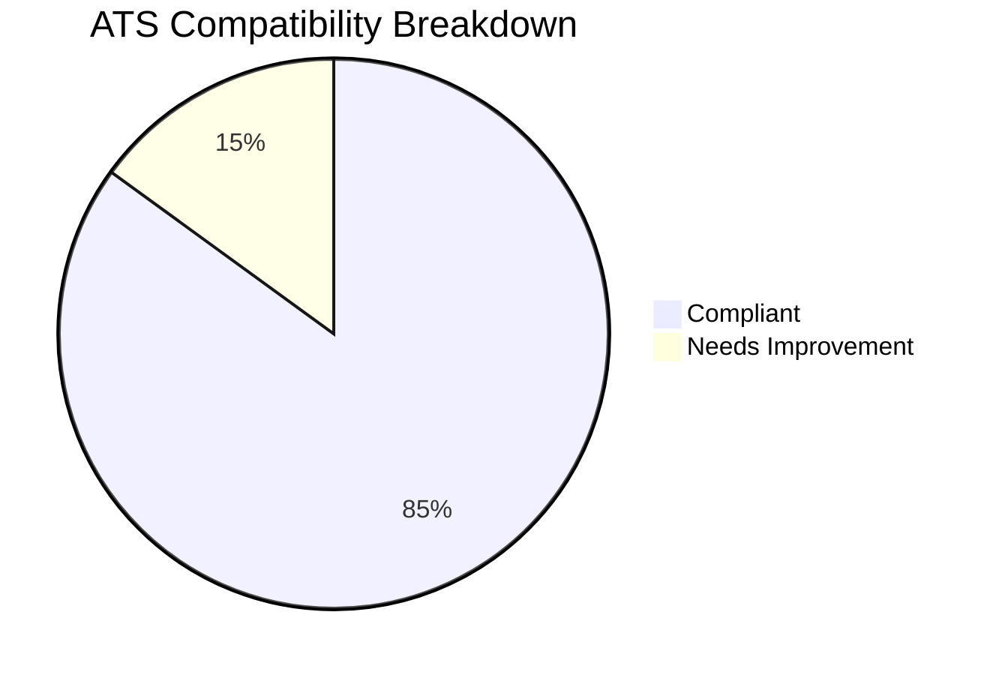
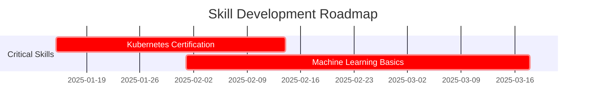
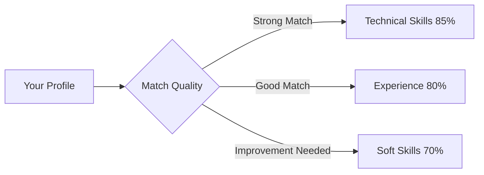

# Report Generator Agent

## Overview

The Report Generator is the culminating agent in the Jobfull Resume Analyzer system, responsible for synthesizing all analysis data into visually-rich, executive-level career intelligence reports with interactive dashboards and predictive insights.

## 🎯 Agent Profile

**Role**: Executive Analytics, Data Visualization & Career Intelligence Specialist  
**Primary Function**: Create comprehensive visual reports with analytics and strategic recommendations  
**Processing Position**: Final in sequential workflow (synthesis point)  
**Output**: Markdown → `final_report.md`

## 🔧 Technical Configuration

### Agent Setup
```python
@agent
def report_generator(self) -> Agent:
    return Agent(
        config=self.agents_config["report_generator"],
        verbose=True,
        llm=LLM("gpt-4o-mini"),
        knowledge_sources=[self.resume_pdf],  # Access to original resume
    )
```

### Task Configuration
```python
@task
def generate_report_task(self) -> Task:
    return Task(
        config=self.tasks_config["generate_report_task"],
        output_file="output/final_report.md",
        context=[  # Receives all previous analysis
            analyze_job_task,
            optimize_resume_task, 
            research_company_task,
            generate_cover_letter_task,
            generate_resume_task
        ]
    )
```

## 📊 Core Capabilities

### 1. Data Visualization & Analytics

#### Mermaid Diagram Generation
**Pie Charts**: ATS compatibility breakdown, skill distribution


**Gantt Charts**: Skill development roadmaps, interview timeline


**Flowcharts**: Decision trees, optimization workflows


#### Unicode Progress Visualization
**Dynamic Progress Bars**: Visual scoring representation
```
Technical Skills: ████████████████████████████████████████████████████████████████████████████████████████▌░░░░░ 85%
Experience Match: ████████████████████████████████████████████████████████████████████████████████░░░░░░░░░░░░░░░░░░░░ 80%
Soft Skills: ██████████████████████████████████████████████████████████████████████░░░░░░░░░░░░░░░░░░░░░░░░░░░░░░░░ 70%
```

**Score Generation Algorithm**:
```python
def generate_progress_bar(score, width=100):
    filled = int(score * width / 100)
    bar = "█" * filled + "▌" if (score * width / 100) % 1 >= 0.5 else ""
    empty = "░" * (width - len(bar))
    return f"{bar}{empty} {score}%"
```

### 2. Executive Dashboard Creation

#### Key Performance Indicators (KPIs)
- **Overall Match Score**: Composite job fit percentage
- **ATS Compatibility**: Format compliance and parsing score  
- **Interview Likelihood**: Probability of callback assessment
- **Competitive Positioning**: Market comparison ranking

#### Priority Matrix System
```markdown
### Priority Actions
1. **🔴 Critical:** Update resume format (.docx, remove tables)
2. **🟡 Important:** Add Kubernetes certification to learning plan  
3. **🟢 Enhancement:** Emphasize leadership experience in cover letter
```

**Color Coding Logic**:
- 🔴 **Critical**: Must-fix issues affecting ATS parsing or basic requirements
- 🟡 **Important**: Significant improvements for competitive advantage
- 🟢 **Enhancement**: Optional optimizations for marginal gains

### 3. Interactive Dashboard Elements

#### Status Indicators
- **🟢 Green**: Strengths and compliant areas (80%+ scores)
- **🟡 Yellow**: Areas needing attention (60-79% scores)  
- **🔴 Red**: Critical gaps requiring immediate action (<60% scores)

#### Achievement Metrics
- **⭐⭐⭐⭐⭐**: 5-star rating system for different competencies
- **📈 Trending**: Growth indicators for developing skills
- **🎯 Target**: Goal-setting indicators for improvement areas

## 🧠 Analysis Synthesis Process

### Data Integration Workflow
```python
def synthesize_analysis_data():
    # Load all analysis files
    job_analysis = load_json("job_analysis.json")
    resume_optimization = load_json("resume_optimization.json") 
    company_research = load_json("company_research.json")
    cover_letter_analysis = load_json("cover_letter_analysis.json")
    
    # Create unified intelligence model
    intelligence = {
        "match_assessment": extract_match_metrics(job_analysis),
        "optimization_priorities": prioritize_improvements(resume_optimization),
        "market_positioning": analyze_competitive_position(company_research),
        "application_strategy": develop_strategy(cover_letter_analysis),
        "success_probability": calculate_success_metrics(all_data)
    }
    
    return intelligence
```

### Predictive Analytics Engine

#### Interview Callback Probability
```python
def calculate_interview_probability(analysis_data):
    factors = {
        "ats_compatibility": analysis_data["ats_score"] * 0.3,
        "technical_match": analysis_data["technical_score"] * 0.25,
        "experience_relevance": analysis_data["experience_score"] * 0.2,
        "company_research_depth": analysis_data["research_quality"] * 0.15,
        "application_quality": analysis_data["materials_score"] * 0.1
    }
    
    probability = sum(factors.values()) / 100
    confidence_level = assess_prediction_confidence(analysis_data)
    
    return {
        "probability": probability,
        "confidence": confidence_level,
        "key_factors": identify_success_drivers(factors)
    }
```

#### Success Trend Analysis
```python
def analyze_success_trends(historical_data, current_analysis):
    trends = {
        "skill_development": track_skill_progression(historical_data),
        "market_alignment": assess_market_fit_evolution(current_analysis),
        "application_quality": measure_material_improvement(historical_data),
        "competitive_positioning": evaluate_market_position_changes(current_analysis)
    }
    
    return generate_trend_insights(trends)
```

## 📈 Visual Report Structure

### Executive Summary Section
```markdown
# Executive Career Intelligence Report
**Job Application Analysis | {current_date}**

## 📊 Executive Dashboard

### Overall Match Score: {overall_score}%
{progress_bar_visualization}

### Dimensional Analysis
- **Technical Skills:** {technical_progress_bar} {technical_score}%
- **Experience Match:** {experience_progress_bar} {experience_score}%
- **Soft Skills:** {soft_skills_progress_bar} {soft_skills_score}%
- **Education:** {education_progress_bar} {education_score}%
```

### ATS Optimization Analysis
```markdown
## 🎯 ATS Optimization Score

{mermaid_pie_chart}

### Critical Success Factors
🟢 **Strengths ({compliance_percentage}% compliance)**
{list_of_strengths}

🟡 **Areas for Improvement**
{list_of_improvements}
```

### Strategic Recommendations
```markdown
## 💼 Application Strategy

### Priority Actions
{priority_matrix_with_color_coding}

### Interview Preparation Focus
{targeted_preparation_areas}

### Success Probability: **{probability_level} ({percentage}%)**
{success_factors_analysis}
```

### Competitive Intelligence
```markdown
## 📊 Competitive Analysis

{mermaid_flowchart_competition}

### Market Positioning
- **Industry Leader** in {domain} ({market_share}% market share)
- **Recent Growth**: {growth_metrics}
- **Competitive Edge**: {differentiation_factors}
```

## 🎨 Visual Design Principles

### Accessibility Standards
- **High Contrast**: Ensuring visibility for all users
- **Screen Reader Compatible**: Proper markdown structure
- **Mobile Responsive**: Readable on all devices
- **Print Friendly**: Professional formatting for hard copies

### Information Hierarchy
1. **Executive Summary**: Key metrics and overall assessment
2. **Detailed Analysis**: Section-by-section breakdown
3. **Strategic Recommendations**: Actionable next steps
4. **Supporting Data**: Evidence and methodology

### Visual Consistency
- **Color Scheme**: Consistent use of 🟢🟡🔴 status indicators
- **Typography**: Clear headers and readable body text
- **Spacing**: Logical grouping and white space usage
- **Icons**: Meaningful symbols for quick recognition

## 🔍 Quality Assurance Features

### Data Validation
```python
def validate_report_data():
    validations = {
        "completeness": check_all_sections_present(),
        "accuracy": verify_data_consistency(),
        "readability": assess_content_clarity(),
        "actionability": evaluate_recommendation_specificity()
    }
    
    return all(validations.values())
```

### Dynamic Content Generation
```python
def generate_dynamic_insights(analysis_data):
    insights = []
    
    # Generate context-aware recommendations
    if analysis_data["technical_score"] < 70:
        insights.append("Focus on technical skill development")
    
    if analysis_data["ats_compliance"] < 80:
        insights.append("Prioritize ATS format optimization")
    
    # Add industry-specific insights
    industry_insights = get_industry_recommendations(analysis_data["industry"])
    insights.extend(industry_insights)
    
    return insights
```

## 📊 Performance Metrics

### Report Quality Indicators
- **Completeness**: All sections populated with relevant data
- **Accuracy**: Data correlations verified across all input sources
- **Actionability**: Specific, implementable recommendations provided
- **Visual Appeal**: Professional presentation with clear hierarchies

### User Experience Metrics
- **Readability Score**: Flesch-Kincaid grade level appropriate for audience
- **Comprehension**: Key insights clearly communicated
- **Decision Support**: Clear next steps and priority guidance
- **Professional Standards**: Executive-level presentation quality

## 🚀 Advanced Features

### Personalization Engine
```python
def personalize_report_content(candidate_profile, industry, role_level):
    personalizations = {
        "tone": adjust_tone_for_role_level(role_level),
        "content_focus": emphasize_relevant_sections(industry),
        "recommendations": tailor_suggestions(candidate_profile),
        "examples": provide_relevant_examples(industry, role_level)
    }
    
    return apply_personalizations(personalizations)
```

### Integration Capabilities
- **Export Options**: PDF generation, email formatting
- **API Access**: Programmatic data extraction
- **Portfolio Integration**: Website and profile updates
- **CRM Connectivity**: Job tracking system updates

---

The Report Generator agent transforms complex multi-source analysis into compelling, actionable career intelligence that empowers candidates with clear direction and strategic advantage in their job search process. 