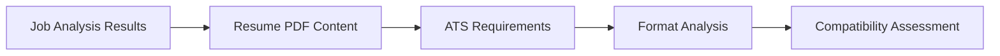

# Resume Analyzer Agent

## 🎯 Agent Overview

The **Resume Analyzer** is a specialized AI agent focused on ATS compatibility analysis, format compliance verification, and keyword optimization strategies. As part of the Jobfull Resume Analyzer system, this agent ensures resumes meet 2025 ATS standards while maintaining human readability.

## 🏷️ Agent Identity

- **Role**: ATS-Optimized Resume Expert & Format Compliance Specialist
- **Goal**: Analyze resumes for ATS compatibility, format compliance, and provide keyword optimization strategies
- **Position**: Agent 2 of 6 in the sequential workflow
- **Dependencies**: Receives input from Job Analyzer Agent
- **Outputs to**: Company Researcher Agent

## 🧠 Agent Expertise

### Primary Specializations
- **ATS Compatibility Analysis**: Deep understanding of 2025 ATS parsing requirements
- **Format Compliance**: Expertise in Workday, Greenhouse, Lever, and iCIMS systems
- **Keyword Optimization**: Strategic keyword placement without stuffing
- **AI Content Detection**: Identifying and preventing AI-generated content flags
- **2025 Standards**: Latest ATS requirements and best practices

### Technical Competencies
- Single-column layout optimization
- Standard font compliance (Arial, Helvetica, Times New Roman)
- Section header standardization
- File format optimization (PDF vs DOCX)
- Parsing-friendly formatting

## 📋 Core Responsibilities

### 1. ATS Compatibility Assessment
```
📊 Compatibility Score: [0-100]
├── Format Structure (25%)
├── Keyword Density (25%)
├── Section Organization (25%)
└── Technical Standards (25%)
```

### 2. Format Compliance Analysis
- **Layout Verification**: Single-column, clean structure
- **Font Assessment**: ATS-friendly typefaces and sizes
- **Element Detection**: Tables, images, graphics that cause parsing issues
- **Header Standardization**: Proper section naming conventions

### 3. Keyword Optimization Strategy
- **Density Analysis**: Optimal keyword frequency without stuffing
- **Placement Strategy**: Strategic positioning for maximum ATS impact
- **Relevance Scoring**: Keyword alignment with job requirements
- **Natural Integration**: Maintaining readability and authenticity

### 4. Content Authenticity Verification
- **AI Detection**: Identifying potentially AI-generated content
- **Originality Assessment**: Ensuring authentic candidate voice
- **Personal Branding**: Maintaining individual professional identity

## 🔄 Agent Workflow

### Input Processing


### Analysis Framework

#### Phase 1: Structure Analysis (30 seconds)
1. **Layout Verification**
   - Column structure assessment
   - Section organization review
   - Visual hierarchy analysis

2. **Format Compliance Check**
   - Font compatibility verification
   - Element parsing assessment
   - File format optimization

#### Phase 2: Content Analysis (45 seconds)
3. **Keyword Assessment**
   - Current keyword extraction
   - Density calculation
   - Relevance scoring against job requirements

4. **ATS Compatibility Scoring**
   - Parsing probability calculation
   - System-specific compliance verification
   - Ranking prediction modeling

#### Phase 3: Optimization Strategy (30 seconds)
5. **Improvement Recommendations**
   - Format adjustments needed
   - Keyword enhancement strategies
   - ATS compliance upgrades

## 📊 Output Specifications

### JSON Output Structure
```json
{
  "resume_analysis": {
    "ats_compatibility_score": 85,
    "format_compliance": {
      "layout_score": 90,
      "font_compliance": 95,
      "element_compatibility": 80,
      "section_organization": 88
    },
    "keyword_analysis": {
      "current_keywords": ["python", "data analysis", "machine learning"],
      "keyword_density": 2.3,
      "missing_critical_keywords": ["sql", "tableau", "aws"],
      "optimization_opportunities": 15
    },
    "recommendations": [
      {
        "category": "format",
        "priority": "high",
        "action": "Remove tables from experience section",
        "impact": "Improves ATS parsing by 15%"
      }
    ],
    "ats_systems_compatibility": {
      "workday": 88,
      "greenhouse": 92,
      "lever": 85,
      "icims": 90
    }
  }
}
```

### Key Metrics Provided
- **Overall ATS Compatibility Score** (0-100)
- **Format Compliance Breakdown** by category
- **Keyword Analysis** with density and gaps
- **System-Specific Scores** for major ATS platforms
- **Prioritized Recommendations** with impact assessments

## 🚀 2025 ATS Standards Compliance

### Critical Requirements
- ✅ **Single-column layouts** only
- ✅ **Standard fonts** (Arial, Helvetica, Times New Roman)
- ✅ **No tables or graphics** that interfere with parsing
- ✅ **Proper section headers** (Experience, Education, Skills)
- ✅ **PDF format optimization** for universal compatibility
- ✅ **Keyword density** between 2-4% for optimal ranking
- ✅ **Anti-AI detection** strategies for authentic content

### Modern ATS Capabilities
- **AI-powered parsing** with enhanced accuracy
- **Semantic understanding** beyond keyword matching
- **Content authenticity detection** for AI-generated text
- **Mobile-optimized parsing** for recruiter apps
- **Integration capabilities** with HRIS systems

## 🔗 Agent Integration

### Input Dependencies
- **Job Requirements Analysis** from Job Analyzer Agent
- **Target Keywords** and industry-specific terms
- **ATS System Information** if known by the employer
- **Resume PDF Content** from knowledge sources

### Output Utilization
- **Company Researcher** uses ATS insights for research focus
- **Resume Writer** implements format and keyword recommendations
- **Cover Letter Generator** aligns content strategy
- **Report Generator** includes compatibility metrics

## 📈 Performance Metrics

### Success Indicators
- **ATS Pass Rate**: Target >85% compatibility score
- **Keyword Coverage**: >90% of critical terms included
- **Format Compliance**: 100% adherence to 2025 standards
- **Parsing Accuracy**: >95% information extraction rate

### Quality Assurance
- **Multi-ATS Testing**: Verification across platforms
- **Human Review Alignment**: Maintaining readability
- **Industry Standards**: Compliance with latest guidelines
- **Continuous Updates**: Adapting to ATS evolution

## 🛠️ Configuration Options

### Customization Parameters
```yaml
resume_analyzer:
  ats_focus: "all"  # workday, greenhouse, lever, icims, all
  keyword_density_target: 2.5  # Percentage (2.0-4.0)
  format_strictness: "high"  # low, medium, high
  ai_detection_sensitivity: "medium"  # low, medium, high
  compatibility_threshold: 85  # Minimum acceptable score
```

### Industry-Specific Modes
- **Technology**: Enhanced technical keyword focus
- **Healthcare**: Compliance with medical terminology
- **Finance**: Regulatory and certification emphasis
- **Government**: Security clearance and format requirements

## 🔧 Troubleshooting

### Common Analysis Issues
1. **Low ATS Score** → Review format compliance and keyword density
2. **Parsing Errors** → Check for tables, graphics, or complex layouts
3. **Keyword Gaps** → Compare against job requirements analysis
4. **Format Warnings** → Verify font choices and section headers

### Optimization Tips
- Focus on the highest-impact recommendations first
- Maintain authentic candidate voice while optimizing
- Test with multiple ATS systems when possible
- Regular updates for evolving ATS capabilities

---

*The Resume Analyzer Agent ensures your resume passes both ATS filters and human review through comprehensive 2025 compliance analysis and strategic optimization recommendations.* 