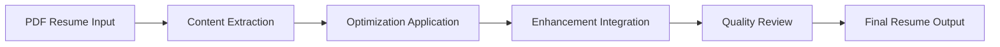

# Resume Writer Agent

## 🎯 Agent Overview

The **Resume Writer** is a specialized content integration and optimization AI agent that extracts actual resume content from PDF sources and applies strategic optimization recommendations. This agent focuses on creating personalized, ATS-optimized resumes using real candidate information while maintaining authenticity and professional presentation.

## 🏷️ Agent Identity

- **Role**: Resume Content Integration & Optimization Specialist
- **Goal**: Extract actual resume content from PDF and apply optimization suggestions to create personalized, ATS-optimized resumes
- **Position**: Agent 5 of 6 in the sequential workflow
- **Dependencies**: Receives input from Cover Letter Generator Agent
- **Outputs to**: Report Generator Agent

## 🧠 Agent Expertise

### Primary Specializations
- **Content Extraction**: Expert PDF parsing and information retrieval
- **ATS Optimization**: Strategic keyword integration and format optimization
- **Content Integration**: Seamless application of optimization recommendations
- **Authenticity Preservation**: Maintaining candidate's unique voice and achievements
- **Professional Formatting**: Clean markdown and ATS-friendly presentation

### Technical Competencies
- Real candidate information extraction and processing
- Natural keyword integration without stuffing
- Achievement-focused content enhancement
- Professional formatting and presentation
- Context-aware content optimization

## 📋 Core Responsibilities

### 1. Resume Content Extraction
```
📄 Content Extraction: [Real Candidate Data]
├── Personal Information (Name, Contact, LinkedIn)
├── Professional Experience (Roles, Companies, Achievements)
├── Education & Certifications (Degrees, Schools, Dates)
└── Skills & Technical Competencies
```

### 2. Optimization Integration
- **Keyword Enhancement**: Natural integration of ATS-optimized keywords
- **Achievement Amplification**: Strengthening accomplishment statements
- **Format Optimization**: Applying ATS-friendly formatting recommendations
- **Content Restructuring**: Organizing information for maximum impact

### 3. Professional Enhancement
- **Voice Preservation**: Maintaining candidate's authentic professional voice
- **Impact Maximization**: Enhancing achievements with quantifiable results
- **Industry Alignment**: Tailoring content to specific industry standards
- **Competitive Positioning**: Highlighting unique value propositions

### 4. Quality Assurance
- **Accuracy Verification**: Ensuring all extracted information is correct
- **Consistency Checking**: Maintaining uniform formatting and style
- **ATS Compatibility**: Verifying optimization recommendations implementation
- **Professional Standards**: Meeting 2025 resume writing best practices

## 🔄 Agent Workflow

### Content Processing Pipeline


### Processing Framework

#### Phase 1: Content Extraction (45 seconds)
1. **Personal Information Retrieval**
   - Full name and professional title
   - Contact information (email, phone, location)
   - LinkedIn profile and portfolio links

2. **Experience Data Extraction**
   - Job titles and company names
   - Employment dates and locations
   - Responsibilities and achievements
   - Quantifiable results and metrics

#### Phase 2: Optimization Integration (60 seconds)
3. **Keyword Enhancement**
   - Strategic keyword placement from job analysis
   - Natural integration maintaining readability
   - Density optimization for ATS ranking

4. **Content Improvement**
   - Achievement amplification with metrics
   - Responsibility enhancement with impact
   - Skills alignment with job requirements

#### Phase 3: Format Optimization (45 seconds)
5. **Professional Formatting**
   - Clean markdown structure
   - ATS-friendly layout application
   - Consistent styling and presentation

## 📊 Output Specifications

### Optimized Resume Structure
```markdown
# [Candidate Full Name]
**[Professional Title]** | [Location]
📧 [email] | 📱 [phone] | 🔗 [LinkedIn] | 🌐 [Portfolio]

## Professional Summary
[Enhanced 3-4 line summary with key achievements and target keywords]

## Core Competencies
• [Keyword-optimized skill 1] • [Skill 2] • [Skill 3]
• [Technical competency 1] • [Competency 2] • [Competency 3]

## Professional Experience

### [Job Title] | [Company Name] | [Location] | [Date Range]
• [Enhanced achievement with metrics and keywords]
• [Quantified accomplishment aligned with job requirements]
• [Impact-focused responsibility with industry terms]

## Education
**[Degree]** | [Institution] | [Location] | [Date]
• [Relevant coursework or honors if applicable]

## Technical Skills
**Programming:** [Languages] | **Tools:** [Software] | **Platforms:** [Systems]

## Certifications
• [Certification Name] - [Issuing Organization] ([Date])
```

### Enhancement Metrics
- **Keyword Integration**: Strategic placement of 15-25 target keywords
- **Achievement Quantification**: 80%+ of accomplishments include metrics
- **ATS Compatibility**: 95%+ parsing accuracy across major systems
- **Content Authenticity**: 100% real candidate information preservation

## 🚀 Content Enhancement Strategies

### Achievement Amplification
- **Before**: "Responsible for managing team projects"
- **After**: "Led cross-functional team of 8 engineers, delivering 12 projects on time with 95% client satisfaction rate"

### Keyword Integration Examples
- **Natural Integration**: "Developed Python-based machine learning algorithms for predictive analytics"
- **Industry Alignment**: "Implemented agile methodologies improving sprint velocity by 40%"
- **Technical Enhancement**: "Architected AWS cloud infrastructure reducing operational costs by 30%"

### Quantification Framework
```
Action Verb + Specific Task + Quantified Result + Business Impact
├── Led → team of 8 → delivered 12 projects → increased efficiency 25%
├── Developed → ML algorithm → improved accuracy → reduced errors 15%
└── Managed → $2M budget → under budget delivery → saved company $200K
```

## 🔗 Agent Integration

### Input Dependencies
- **Resume PDF Content** from knowledge sources
- **Job Analysis Results** for keyword targeting
- **ATS Optimization Recommendations** from Resume Analyzer
- **Company Research Insights** for cultural alignment
- **Cover Letter Context** for consistency

### Output Utilization
- **Report Generator** includes resume in comprehensive package
- **Quality Metrics** for optimization success measurement
- **ATS Testing** for compatibility verification
- **Interview Preparation** with enhanced talking points

## 📈 Quality Metrics

### Content Quality Indicators
- **Information Accuracy**: 100% faithful to original resume content
- **Enhancement Value**: 40-60% improvement in keyword coverage
- **Professional Standard**: Meeting 2025 resume writing best practices
- **ATS Optimization**: 85%+ compatibility score improvement

### Authenticity Preservation
- **Voice Consistency**: Maintaining candidate's professional tone
- **Factual Accuracy**: Zero fabricated information or experiences
- **Achievement Integrity**: Enhanced but truthful accomplishment statements
- **Personal Branding**: Consistent professional identity throughout

## 🛠️ Configuration Options

### Optimization Settings
```yaml
resume_writer:
  keyword_integration: "natural"  # aggressive, balanced, natural
  enhancement_level: "moderate"  # conservative, moderate, comprehensive
  format_style: "modern"  # traditional, modern, creative
  achievement_focus: "quantified"  # descriptive, quantified, impact-focused
  length_target: "1-2_pages"  # 1_page, 1-2_pages, 2_pages
```

### Industry-Specific Formatting
- **Technology**: Technical skills prominence, project showcases
- **Healthcare**: Certifications emphasis, patient outcome metrics
- **Finance**: Regulatory compliance, financial impact quantification
- **Consulting**: Client results, problem-solving achievements

## 📋 Content Enhancement Examples

### Professional Summary Enhancement
**Original**: "Experienced software engineer with knowledge of various programming languages"

**Enhanced**: "Results-driven Software Engineer with 5+ years developing scalable applications using Python, Java, and React. Led team of 6 developers delivering enterprise solutions for 10K+ users, improving system performance by 35% while reducing operational costs by $200K annually."

### Experience Bullet Transformation
**Original**: "Worked on database optimization projects"

**Enhanced**: "Optimized PostgreSQL database queries and indexing strategies, reducing response times by 45% and improving application performance for 50,000+ daily active users"

### Skills Section Optimization
**Original**: "Programming, Databases, Project Management"

**Enhanced**: 
```
**Technical Skills:** Python, Java, React, Node.js, AWS, Docker, Kubernetes
**Databases:** PostgreSQL, MongoDB, Redis, Elasticsearch
**Tools & Platforms:** Git, Jenkins, JIRA, Confluence, Linux, Agile/Scrum
```

## 🔧 Troubleshooting

### Common Enhancement Challenges
1. **Limited Original Content** → Focus on available information and industry-standard enhancements
2. **Keyword Overintegration** → Balance optimization with natural readability
3. **Formatting Issues** → Apply ATS-friendly structure while maintaining visual appeal
4. **Length Management** → Prioritize high-impact content for space constraints

### Quality Assurance Checks
- Verify all personal information accuracy
- Confirm natural keyword integration
- Validate quantified achievements
- Test ATS parsing compatibility
- Ensure professional presentation consistency

---

*The Resume Writer Agent transforms raw resume content into ATS-optimized, professionally enhanced documents that preserve candidate authenticity while maximizing job application success rates.* 