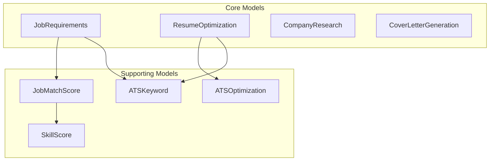
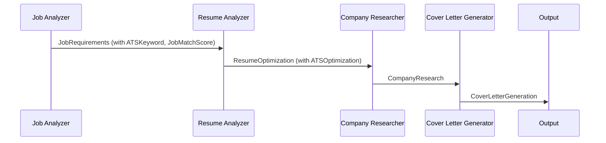

# Data Models Documentation

## Overview

The Jobfull Resume Analyzer uses comprehensive Pydantic models to ensure structured, validated data throughout the analysis pipeline. These models define the schema for all agent outputs and provide type safety and validation.

## 📊 Model Architecture



## 🎯 Core Models

### JobRequirements
**Purpose**: Complete job analysis with ATS optimization and candidate scoring  
**Output File**: `job_analysis.json`  
**Agent**: Job Analyzer

#### Key Fields:
```python
class JobRequirements(BaseModel):
    # Basic Job Information
    job_title: str
    department: Optional[str]
    job_level: Optional[str]
    location_requirements: Dict[str, str]
    
    # Requirements Analysis
    technical_skills: List[str]
    soft_skills: List[str]
    experience_requirements: List[str]
    education_requirements: List[str]
    
    # ATS Enhancement
    ats_keywords: List[ATSKeyword]
    ats_system_type: Optional[str]
    industry_trends_2025: List[str]
    
    # Scoring & Analysis
    match_score: JobMatchScore
    score_explanation: List[str]
```

#### Special Features:
- **ATS Keywords**: Weighted importance (1-5), categorized by type
- **2025 Trends**: Industry-specific trending keywords
- **Comprehensive Scoring**: Multi-dimensional candidate evaluation
- **Strategic Insights**: Actionable recommendations for optimization

### ResumeOptimization
**Purpose**: ATS format compliance and content optimization recommendations  
**Output File**: `resume_optimization.json`  
**Agent**: Resume Analyzer

#### Key Fields:
```python
class ResumeOptimization(BaseModel):
    # Content Optimization
    content_suggestions: List[Dict[str, str]]  # before/after examples
    skills_to_highlight: List[str]
    achievements_to_add: List[str]
    keywords_for_ats: List[str]
    
    # ATS Specific
    ats_optimization: ATSOptimization
    keyword_integration_strategy: Dict[str, List[str]]
    content_originality_check: Dict[str, bool]
    
    # Section-by-Section
    section_optimization: Dict[str, List[str]]
```

#### Special Features:
- **Before/After Examples**: Specific content improvement suggestions
- **ATS Compliance**: Format validation and parsing optimization
- **Originality Check**: Anti-AI detection and authenticity verification
- **Strategic Integration**: Section-specific keyword placement

### CompanyResearch
**Purpose**: Comprehensive company intelligence and market analysis  
**Output File**: `company_research.json`  
**Agent**: Company Researcher

#### Key Fields:
```python
class CompanyResearch(BaseModel):
    # Foundation Analysis
    recent_developments: List[str]
    culture_and_values: List[str]
    market_position: Dict[str, List[str]]
    growth_trajectory: List[str]
    
    # Strategic Intelligence
    company_priorities: List[str]
    leadership_team: List[str]
    competitive_advantages: List[str]
    
    # Interview Preparation
    interview_questions: List[str]
    interview_insights: List[str]
```

#### Special Features:
- **Market Intelligence**: Competitive positioning and industry trends
- **Cultural Analysis**: Company values and work environment insights
- **Interview Preparation**: Strategic questions and talking points
- **Leadership Intelligence**: Key personnel and organizational structure

### CoverLetterGeneration
**Purpose**: Personalized cover letter analysis and content generation  
**Output File**: `cover_letter_analysis.json`  
**Agent**: Cover Letter Generator

#### Key Fields:
```python
class CoverLetterGeneration(BaseModel):
    # Content Generation
    cover_letter_content: str  # Full markdown content
    personalization_elements: List[str]
    key_selling_points: List[str]
    company_connections: List[str]
    
    # Quality Metrics
    customization_level: confloat(ge=0, le=1)
    impact_score: confloat(ge=0, le=1)
    ats_optimization: Dict[str, Any]
    length_metrics: Dict[str, int]
```

#### Special Features:
- **Full Content**: Complete cover letter in markdown format
- **Personalization Tracking**: Specific customization elements
- **Quality Scoring**: Customization level and impact assessment
- **ATS Integration**: Keyword optimization and format compliance

## 🔧 Supporting Models

### ATSKeyword
**Purpose**: Structured ATS keyword analysis with importance weighting

```python
class ATSKeyword(BaseModel):
    keyword: str                      # The keyword or phrase
    importance: int                   # 1-5 scale importance
    category: str                     # technical, soft, experience, industry
    required: bool                    # Required vs preferred
    frequency: int                    # Times mentioned in job description
```

**Usage**: Embedded in `JobRequirements.ats_keywords`

### ATSOptimization
**Purpose**: Comprehensive ATS compatibility analysis

```python
class ATSOptimization(BaseModel):
    ats_compatibility_score: confloat(ge=0, le=1)
    keyword_density: Dict[str, float]
    format_compliance: Dict[str, bool]
    optimization_suggestions: List[str]
    parsing_warnings: List[str]
```

**Format Compliance Checklist**:
- `single_column`: Single-column layout verification
- `standard_fonts`: Arial, Times New Roman, Calibri compliance
- `no_tables`: Table-free formatting
- `no_images`: Image-free content
- `no_headers_footers`: Content in body only
- `standard_sections`: Proper section headers
- `doc_format`: .docx/.doc format compatibility

### SkillScore
**Purpose**: Individual skill assessment with context analysis

```python
class SkillScore(BaseModel):
    skill_name: str
    required: bool
    match_level: confloat(ge=0, le=1)
    years_experience: Optional[float]
    context_score: confloat(ge=0, le=1)
    ats_keyword_match: bool
```

**Scoring Factors**:
- **Match Level**: How well candidate experience matches requirement
- **Context Score**: Relevance of skill usage context to job
- **ATS Integration**: Whether skill matches ATS keywords

### JobMatchScore
**Purpose**: Comprehensive candidate-job fit analysis

```python
class JobMatchScore(BaseModel):
    # Overall Scoring
    overall_match: confloat(ge=0, le=100)
    
    # Dimensional Analysis (0-100 scale)
    technical_skills_match: confloat(ge=0, le=100)    # 35% weight
    soft_skills_match: confloat(ge=0, le=100)         # 20% weight
    experience_match: confloat(ge=0, le=100)          # 25% weight
    education_match: confloat(ge=0, le=100)           # 10% weight
    industry_match: confloat(ge=0, le=100)            # 10% weight
    
    # Detailed Analysis
    skill_details: List[SkillScore]
    strengths: List[str]
    gaps: List[str]
    ats_gaps: List[str]
    
    # Methodology
    scoring_factors: Dict[str, float]  # Weighting configuration
```

## 📋 Data Validation

### Type Safety
All models use Pydantic for runtime type validation:
- **String Validation**: Required vs optional fields
- **Numeric Constraints**: confloat with min/max bounds
- **List Validation**: Proper list types and default factories
- **Nested Models**: Complex object validation

### Business Logic Validation
- **Score Ranges**: 0-1 for ratios, 0-100 for percentages
- **Importance Levels**: 1-5 scale for keyword importance
- **Required Fields**: Critical data must be present
- **Default Values**: Sensible defaults for optional fields

### Data Consistency
- **Cross-Model References**: Consistent data across models
- **Context Validation**: Proper task dependency handling
- **Format Standards**: Consistent output formatting

## 🔄 Data Flow Integration

### Model Relationships


### Context Passing
Each model is designed to provide context for subsequent tasks:
1. **JobRequirements** → Establishes ATS keywords and scoring framework
2. **ResumeOptimization** → Identifies gaps and improvement areas
3. **CompanyResearch** → Provides market intelligence and cultural insights
4. **CoverLetterGeneration** → Synthesizes all data for personalization

## 🎯 Usage Examples

### Accessing ATS Keywords
```python
# From job_analysis.json
job_req = JobRequirements.parse_file("job_analysis.json")
for keyword in job_req.ats_keywords:
    if keyword.importance >= 4 and keyword.required:
        print(f"Critical keyword: {keyword.keyword}")
```

### Checking ATS Compliance
```python
# From resume_optimization.json
resume_opt = ResumeOptimization.parse_file("resume_optimization.json")
if not resume_opt.ats_optimization.format_compliance["single_column"]:
    print("Warning: Multi-column layout detected")
```

### Analyzing Match Score
```python
# Overall candidate fit
match_score = job_req.match_score
print(f"Overall match: {match_score.overall_match}%")
print(f"Technical skills: {match_score.technical_skills_match}%")
```

---

These models ensure that all data flowing through the system is structured, validated, and provides comprehensive intelligence for job application optimization. 