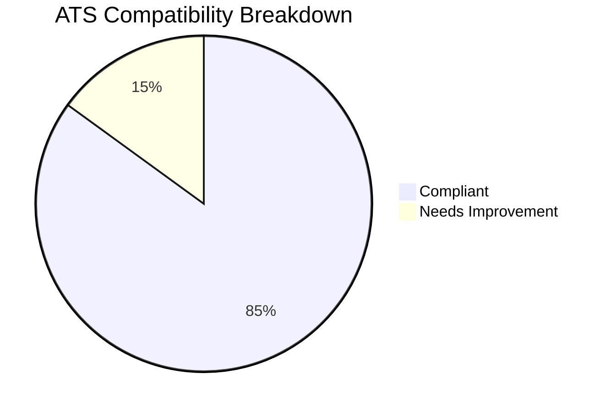
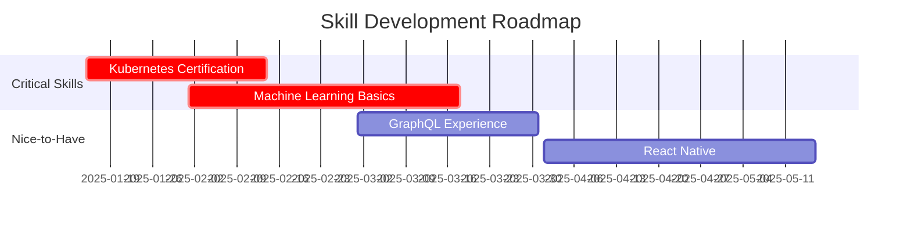
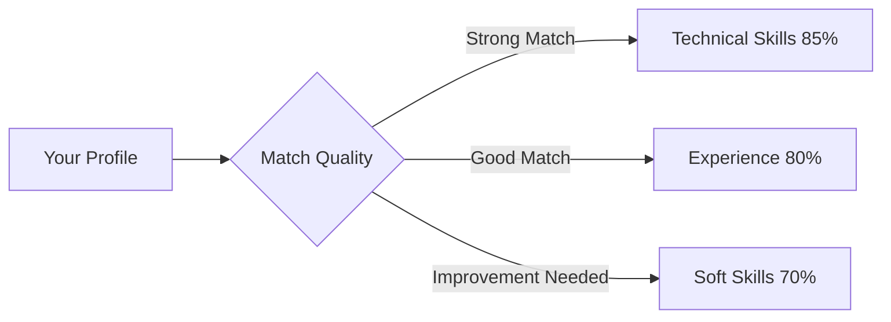

# Output Specifications

## Overview

The Jobfull Resume Analyzer generates comprehensive outputs across 7 files, combining structured JSON analysis with professional markdown deliverables. This document provides detailed specifications for each output file.

## 📁 Output File Structure

```
output/
├── job_analysis.json              # 📊 Job requirements and ATS analysis
├── resume_optimization.json       # 🔧 Resume improvement recommendations  
├── company_research.json          # 🏢 Company intelligence and market analysis
├── cover_letter_analysis.json     # 📝 Cover letter strategy analysis
├── cover_letter.md                # 📄 Professional cover letter (ready-to-use)
├── optimized_resume.md            # 📋 Optimized resume (ready-to-use)
└── final_report.md                # 📈 Executive report with visualizations
```

## 🎯 JSON Analysis Files

### 1. job_analysis.json

**Purpose**: Comprehensive job requirements analysis with ATS optimization  
**Agent**: Job Analyzer  
**Model**: `JobRequirements`

#### Structure Overview
```json
{
  "job_title": "Senior Software Engineer",
  "department": "Engineering",
  "job_level": "Senior",
  "location_requirements": {
    "type": "Hybrid",
    "location": "San Francisco, CA",
    "remote_percentage": "50%"
  },
  "technical_skills": [
    "Python", "React", "AWS", "Docker", "Kubernetes"
  ],
  "soft_skills": [
    "Leadership", "Communication", "Problem-solving"
  ],
  "ats_keywords": [
    {
      "keyword": "Python",
      "importance": 5,
      "category": "technical",
      "required": true,
      "frequency": 8
    }
  ],
  "match_score": {
    "overall_match": 78.5,
    "technical_skills_match": 85.0,
    "soft_skills_match": 70.0,
    "experience_match": 80.0,
    "education_match": 75.0,
    "industry_match": 82.0,
    "skill_details": [
      {
        "skill_name": "Python",
        "required": true,
        "match_level": 0.9,
        "years_experience": 5.0,
        "context_score": 0.85,
        "ats_keyword_match": true
      }
    ],
    "strengths": [
      "Strong technical background in required technologies",
      "Relevant industry experience in scalable systems"
    ],
    "gaps": [
      "Limited machine learning experience",
      "No Kubernetes certification mentioned"
    ]
  }
}
```

#### Key Sections
- **Basic Information**: Job details, department, level
- **Requirements**: Technical/soft skills, experience, education
- **ATS Analysis**: Weighted keywords with importance scoring
- **Candidate Scoring**: Multi-dimensional match analysis (0-100 scale)
- **Strategic Insights**: Strengths, gaps, optimization opportunities

### 2. resume_optimization.json

**Purpose**: Format compliance and content optimization recommendations  
**Agent**: Resume Analyzer  
**Model**: `ResumeOptimization`

#### Structure Overview
```json
{
  "content_suggestions": [
    {
      "section": "Professional Summary",
      "before": "Experienced software developer",
      "after": "Senior Software Engineer with 5+ years developing scalable Python applications"
    }
  ],
  "skills_to_highlight": [
    "Python (5 years)", "AWS architecture", "Microservices design"
  ],
  "ats_optimization": {
    "ats_compatibility_score": 0.85,
    "keyword_density": {
      "Python": 2.3,
      "AWS": 1.8,
      "Docker": 1.2
    },
    "format_compliance": {
      "single_column": true,
      "standard_fonts": true,
      "no_tables": false,
      "no_images": true,
      "no_headers_footers": true,
      "standard_sections": true,
      "doc_format": false
    },
    "optimization_suggestions": [
      "Convert table format to bullet points",
      "Save in .docx format instead of PDF",
      "Increase 'Kubernetes' keyword frequency"
    ],
    "parsing_warnings": [
      "Table in experience section may cause parsing issues"
    ]
  },
  "keyword_integration_strategy": {
    "professional_summary": ["Python", "AWS", "Leadership"],
    "experience": ["Docker", "Kubernetes", "Microservices"],
    "skills": ["React", "Node.js", "PostgreSQL"]
  }
}
```

#### Key Features
- **Before/After Examples**: Specific content improvements
- **ATS Compliance**: Format validation checklist
- **Keyword Strategy**: Section-specific keyword placement
- **Parsing Warnings**: Potential ATS issues to address

### 3. company_research.json

**Purpose**: Company intelligence and market analysis  
**Agent**: Company Researcher  
**Model**: `CompanyResearch`

#### Structure Overview
```json
{
  "recent_developments": [
    "Launched new AI-powered recommendation engine (Q4 2024)",
    "Acquired startup focused on edge computing (Dec 2024)",
    "Announced $500M Series D funding round"
  ],
  "culture_and_values": [
    "Innovation and experimentation",
    "Diversity and inclusion focus",
    "Remote-first culture with quarterly offsites"
  ],
  "market_position": {
    "competitors": ["Competitor A", "Competitor B"],
    "market_share": "15% in cloud services sector",
    "differentiation": ["Superior API performance", "Developer-first approach"]
  },
  "company_priorities": [
    "AI/ML integration across all products",
    "International expansion (EU, APAC)",
    "Carbon neutrality by 2025"
  ],
  "interview_questions": [
    "How do you approach system design for high-traffic applications?",
    "Describe your experience with our technology stack",
    "How do you stay current with emerging technologies?"
  ],
  "leadership_team": [
    "CEO: John Smith - Former Google VP, 15 years experience",
    "CTO: Sarah Johnson - Ex-Netflix architect, AI/ML expert"
  ]
}
```

#### Intelligence Categories
- **Market Analysis**: Competitive positioning and trends
- **Cultural Intelligence**: Values, work environment, policies
- **Strategic Priorities**: Current focus areas and initiatives
- **Interview Preparation**: Common questions and talking points

### 4. cover_letter_analysis.json

**Purpose**: Cover letter strategy and personalization analysis  
**Agent**: Cover Letter Generator  
**Model**: `CoverLetterGeneration`

#### Structure Overview
```json
{
  "cover_letter_content": "Full markdown content of the cover letter...",
  "personalization_elements": [
    "Mentioned company's recent AI initiative",
    "Referenced specific technology stack (Python, AWS)",
    "Connected previous experience to company challenges"
  ],
  "key_selling_points": [
    "5+ years Python development experience",
    "Led team of 8 engineers on microservices migration",
    "Reduced API response time by 40% through optimization"
  ],
  "company_connections": [
    "Alignment with innovation culture",
    "Experience with similar scaling challenges",
    "Passion for developer tools and APIs"
  ],
  "ats_optimization": {
    "keyword_integration": {
      "Python": 3,
      "AWS": 2,
      "Leadership": 2
    },
    "keyword_density": 2.1
  },
  "length_metrics": {
    "word_count": 385,
    "paragraph_count": 4,
    "sentence_count": 16
  },
  "customization_level": 0.87,
  "impact_score": 0.82
}
```

#### Analysis Elements
- **Personalization Tracking**: Company-specific elements included
- **Selling Points**: Key achievements and capabilities highlighted
- **ATS Integration**: Keyword usage and optimization
- **Quality Metrics**: Customization level and impact assessment

## 📄 Markdown Deliverables

### 5. cover_letter.md

**Purpose**: Professional, ready-to-use cover letter  
**Format**: Business letter in markdown

#### Structure Template
```markdown
January 15, 2025

John Doe
john.doe@email.com | (555) 123-4567 | linkedin.com/in/johndoe

Hiring Manager
Company Name
Company Address

Dear Hiring Manager,

I am writing to express my strong interest in the Senior Software Engineer position at [Company]. With over 5 years of experience developing scalable Python applications and a proven track record of leading high-performing engineering teams, I am excited about the opportunity to contribute to [Company]'s innovative AI-powered platform.

In my current role at [Previous Company], I successfully led the migration of our monolithic architecture to microservices, resulting in a 40% improvement in API response times and enabling our platform to scale to over 1 million daily active users. This experience aligns perfectly with [Company]'s focus on building robust, scalable infrastructure to support your growing user base.

Your recent launch of the AI-powered recommendation engine particularly resonates with me, as I have extensive experience implementing machine learning models in production environments. At [Previous Company], I collaborated closely with data science teams to deploy ML models that improved user engagement by 25%, demonstrating my ability to bridge the gap between engineering and data science – a skill that would be valuable as [Company] continues to integrate AI across your product suite.

I am particularly drawn to [Company]'s commitment to innovation and your developer-first culture. Having worked in fast-paced startup environments, I thrive in settings where experimentation and rapid iteration are encouraged. I am excited about the opportunity to contribute to your mission of empowering developers with world-class tools and infrastructure.

Thank you for considering my application. I would welcome the opportunity to discuss how my technical expertise and leadership experience can contribute to [Company]'s continued growth and success.

Sincerely,
John Doe
```

#### Key Features
- **Today's Date**: Automatically generated current date
- **Real Contact Info**: Extracted from resume PDF
- **Company-Specific**: Personalized content based on research
- **Achievement-Focused**: Quantified accomplishments
- **Professional Formatting**: Business letter standards

### 6. optimized_resume.md

**Purpose**: ATS-optimized resume with real content integration  
**Format**: Professional resume in markdown

#### Structure Template
```markdown
# John Doe

**Email:** john.doe@email.com | **Phone:** (555) 123-4567  
**LinkedIn:** linkedin.com/in/johndoe | **Location:** San Francisco, CA

## Professional Summary

Senior Software Engineer with 5+ years of experience developing scalable Python applications and leading high-performing engineering teams. Proven expertise in cloud architecture (AWS), microservices design, and API optimization. Successfully reduced system response times by 40% and led teams of up to 8 engineers through complex technical migrations.

## Technical Skills

**Programming Languages:** Python, JavaScript, TypeScript, Go  
**Frameworks & Libraries:** React, Node.js, Django, Flask, FastAPI  
**Cloud & Infrastructure:** AWS (EC2, S3, Lambda, RDS), Docker, Kubernetes  
**Databases:** PostgreSQL, MongoDB, Redis  
**Tools & Technologies:** Git, Jenkins, Terraform, Prometheus, Grafana

## Professional Experience

### Senior Software Engineer | TechCorp Inc. | 2022 - Present

- **Led microservices migration** for monolithic application serving 1M+ daily active users
- **Optimized API performance** resulting in 40% reduction in response times
- **Managed team of 8 engineers** through complex technical initiatives
- **Implemented CI/CD pipelines** reducing deployment time by 60%
- **Designed cloud architecture** supporting 99.9% uptime SLA

### Software Engineer | StartupXYZ | 2020 - 2022

- **Developed RESTful APIs** using Python/Django serving 100K+ requests/day
- **Built React frontend** components improving user engagement by 25%
- **Collaborated with data science team** to deploy ML models in production
- **Established monitoring systems** using Prometheus and Grafana

## Education

**Bachelor of Science in Computer Science**  
University of California, Berkeley | 2020

## Certifications

- AWS Certified Solutions Architect - Associate (2023)
- Certified Kubernetes Administrator (CKA) - 2022
```

#### Optimization Features
- **ATS Keywords**: Natural integration of job-required terms
- **Quantified Achievements**: Metrics and impact statements
- **Format Compliance**: Single-column, standard formatting
- **Real Content**: Extracted from actual resume PDF
- **Section Optimization**: Strategic keyword placement

### 7. final_report.md

**Purpose**: Executive-level analytics report with visualizations  
**Agent**: Report Generator

#### Structure Template
```markdown
# Executive Career Intelligence Report
**Job Application Analysis | January 15, 2025**

## 📊 Executive Dashboard

### Overall Match Score: 78.5%
████████████████████████████████████████████████████████████████████████████████▌░░░░░░░░░░░░░░░░░░░░ 78.5%

### Dimensional Analysis
- **Technical Skills:** ████████████████████████████████████████████████████████████████████████████████████████▌░░░░░ 85%
- **Experience Match:** ████████████████████████████████████████████████████████████████████████████████░░░░░░░░░░░░░░░░░░░░ 80%
- **Soft Skills:** ██████████████████████████████████████████████████████████████████████░░░░░░░░░░░░░░░░░░░░░░░░░░░░░░░░ 70%
- **Education:** ███████████████████████████████████████████████████████████████████████████░░░░░░░░░░░░░░░░░░░░░░░░░░░ 75%

## 🎯 ATS Optimization Score



### Critical Success Factors
🟢 **Strengths (85% compliance)**
- Single-column layout ✅
- Standard fonts used ✅
- No images or graphics ✅
- Proper section headers ✅

🟡 **Areas for Improvement**
- Convert tables to bullet points
- Save in .docx format
- Increase keyword density for "Kubernetes"

## 📈 Skill Gap Analysis



## 🏢 Company Intelligence Summary

### Market Position
- **Industry Leader** in cloud infrastructure (15% market share)
- **Recent Growth**: $500M Series D funding, 40% YoY growth
- **Competitive Edge**: Superior API performance, developer-first approach

### Strategic Priorities 2025
1. **AI/ML Integration** across all product lines
2. **International Expansion** (EU, APAC markets)
3. **Carbon Neutrality** by end of 2025

## 💼 Application Strategy

### Priority Actions
1. **🔴 Critical:** Update resume format (.docx, remove tables)
2. **🟡 Important:** Add Kubernetes certification to learning plan
3. **🟢 Enhancement:** Emphasize leadership experience in cover letter

### Interview Preparation Focus
- System design for high-traffic applications
- Experience with company's technology stack
- Approach to emerging technology adoption

## 📊 Competitive Analysis



## 🎯 Success Probability

### Interview Callback Likelihood: **High (78%)**
- Strong technical alignment
- Relevant industry experience
- ATS optimization achieved

### Recommended Next Steps
1. Apply optimization recommendations
2. Prepare for technical system design interview
3. Research company's latest AI initiatives
4. Network with current employees on LinkedIn

---

**Generated by Jobfull Resume Analyzer | AI-Powered Career Intelligence**
```

#### Visual Elements
- **Unicode Progress Bars**: Visual scoring representation
- **Mermaid Diagrams**: Pie charts, gantt charts, flowcharts
- **Priority Matrices**: Color-coded action items
- **Interactive Dashboard**: Executive-level presentation

## 📋 File Specifications

### JSON File Standards
- **Encoding**: UTF-8
- **Format**: Pretty-printed with 2-space indentation
- **Validation**: Pydantic model validation enforced
- **Size**: Typically 10-50KB per file

### Markdown File Standards
- **Format**: CommonMark compliant
- **Encoding**: UTF-8
- **Line Endings**: Unix-style (LF)
- **Images**: Mermaid diagrams embedded as code blocks

### Output Quality Metrics
- **Completeness**: All 7 files generated successfully
- **Accuracy**: Data validation through Pydantic models
- **Consistency**: Cross-file data correlation maintained
- **Usability**: Professional, ready-to-use deliverables

---

These specifications ensure consistent, high-quality outputs that provide comprehensive job application intelligence and ready-to-use professional materials. 