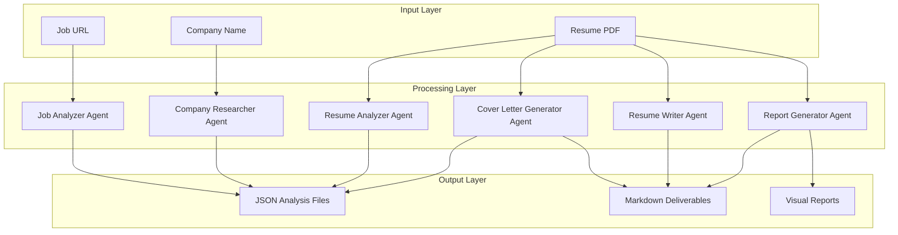
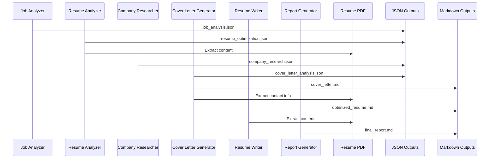

# System Architecture

## Overview

The Jobfull Resume Analyzer is built on CrewAI framework with a sequential processing model where 6 specialized AI agents collaborate through 7 interconnected tasks to produce comprehensive job application optimization.

## 🏗️ High-Level Architecture



## 🔄 Sequential Processing Workflow

### Phase 1: Job Requirements Analysis
**Agent**: Job Analyzer  
**Input**: Job URL  
**Output**: `job_analysis.json`

1. **ATS Keyword Extraction**: Identifies and categorizes ATS-specific keywords
2. **Industry Trend Analysis**: Incorporates 2025 industry standards
3. **Scoring Framework**: Establishes match criteria and weighting
4. **Format Requirements**: Detects ATS system type and requirements

### Phase 2: Resume Optimization Analysis
**Agent**: Resume Analyzer  
**Input**: Job analysis + Resume PDF  
**Output**: `resume_optimization.json`

1. **Format Compliance Check**: ATS compatibility assessment
2. **Content Originality**: Anti-AI detection analysis
3. **Keyword Strategy**: Gap analysis and integration planning
4. **Section Optimization**: Detailed improvement recommendations

### Phase 3: Company Intelligence
**Agent**: Company Researcher  
**Input**: Previous analysis + Company name  
**Output**: `company_research.json`

1. **Market Analysis**: 2025 industry trends and positioning
2. **Cultural Intelligence**: Company values and work environment
3. **Interview Preparation**: Strategic insights and common questions
4. **Competitive Positioning**: Market differentiation analysis

### Phase 4: Cover Letter Generation
**Agent**: Cover Letter Generator  
**Input**: All previous analysis + Resume PDF  
**Output**: `cover_letter_analysis.json` + `cover_letter.md`

1. **Contact Extraction**: Real contact details from PDF
2. **Content Strategy**: Achievement-focused narrative planning
3. **ATS Optimization**: Keyword integration and formatting
4. **Personalization**: Company-specific connections and insights

### Phase 5: Resume Content Creation
**Agent**: Resume Writer  
**Input**: All analysis + Resume PDF  
**Output**: `optimized_resume.md`

1. **Content Integration**: Real resume content extraction
2. **Optimization Application**: Implements recommendations
3. **ATS Formatting**: Ensures compliance and readability
4. **Enhancement**: Adds quantified achievements and keywords

### Phase 6: Executive Reporting
**Agent**: Report Generator  
**Input**: All analysis and deliverables  
**Output**: `final_report.md`

1. **Data Visualization**: Mermaid diagrams and charts
2. **Dashboard Creation**: Interactive scoring elements
3. **Analytics**: Predictive insights and trends
4. **Strategic Recommendations**: Actionable next steps

## 🧠 Agent Coordination

### Context Sharing
Each agent receives context from previous tasks through CrewAI's sequential processing:

```python
@task
def optimize_resume_task(self) -> Task:
    return Task(
        config=self.tasks_config["optimize_resume_task"],
        output_file="output/resume_optimization.json",
        output_pydantic=ResumeOptimization,
        context=[analyze_job_task]  # Receives job analysis
    )
```

### Knowledge Sources
All content-generation agents have access to the resume PDF:

```python
knowledge_sources=[self.resume_pdf]
```

### Tool Integration
- **Job Analyzer**: Web scraping for job description extraction
- **Company Researcher**: Search tools for company intelligence
- **Other Agents**: PDF knowledge source for resume content

## 🗃️ Data Flow Architecture



## 🎯 Processing Strategy

### Sequential Execution Benefits
1. **Context Building**: Each agent builds upon previous analysis
2. **Data Consistency**: Unified understanding across all deliverables
3. **Quality Control**: Each step validates and enhances previous work
4. **Resource Optimization**: Efficient use of API calls and processing

### Dependency Management
```yaml
# Task Dependencies (from tasks.yaml)
optimize_resume_task:
  context: [analyze_job_task]

research_company_task:
  context: [analyze_job_task, optimize_resume_task]

generate_cover_letter_task:
  context: [analyze_job_task, optimize_resume_task, research_company_task]
```

## 🔧 Technical Implementation

### Framework: CrewAI
- **Process**: Sequential with context passing
- **LLM**: GPT-4o-mini for all agents
- **Output**: Structured Pydantic models + file outputs

### Key Components
```python
@CrewBase
class ResumeCrew:
    agents_config = "config/agents.yaml"
    tasks_config = "config/tasks.yaml"
    
    def __init__(self):
        self.resume_pdf = PDFKnowledgeSource(file_paths="GhonemCV_2025.pdf")
```

### Data Models
Comprehensive Pydantic models ensure structured output:
- `JobRequirements`: ATS analysis and scoring
- `ResumeOptimization`: Improvement recommendations
- `CompanyResearch`: Intelligence and insights
- `CoverLetterGeneration`: Personalized content analysis

## 📊 Quality Assurance

### ATS Compliance
- **Format Validation**: Single-column, standard fonts, no tables/images
- **Keyword Optimization**: Natural integration without stuffing
- **System Compatibility**: Workday, Greenhouse, Lever, iCIMS support

### Content Quality
- **Real Content Extraction**: No placeholders or generic templates
- **Anti-AI Detection**: Original, personalized content
- **Professional Standards**: Executive-level deliverables

### Output Consistency
- **Structured Data**: JSON outputs for programmatic access
- **Professional Formatting**: Markdown for human readability
- **Visual Elements**: Mermaid diagrams and interactive dashboards

---

This architecture ensures comprehensive, high-quality job application optimization while maintaining scalability and consistency across all deliverables. 