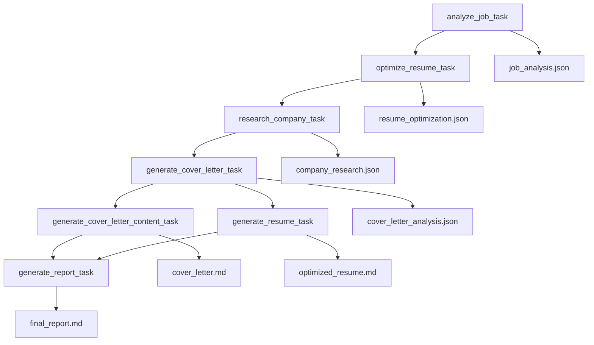

# Task Orchestration

## Overview

The Jobfull Resume Analyzer uses a sophisticated 7-task sequential workflow where each task builds upon previous results through context sharing and knowledge accumulation. This orchestration ensures comprehensive analysis and high-quality deliverables.

## 🔄 Task Execution Flow



## 📋 Task Details

### 1. Job Analysis Task
**Agent**: Job Analyzer  
**Dependencies**: None (Entry point)  
**Input Variables**: `job_url`, `company_name`

#### 5-Step Process:
1. **Job Requirements & ATS Analysis**
   - Extract technical/soft skills, experience, education requirements
   - Identify ATS system type from job posting
   - Extract weighted ATS keywords (1-5 importance scale)
   - Note 2025 industry trending keywords

2. **Keyword Extraction & Prioritization**
   - Primary ATS keywords (exact matches required)
   - Secondary keywords (contextual matches)
   - Industry-specific 2025 trends
   - Compliance keywords (certifications, regulations)

3. **Candidate Scoring Framework**
   - Technical Skills (35%): ATS matching, experience, context
   - Soft Skills (20%): Leadership, communication evidence
   - Experience (25%): Role similarity, industry relevance
   - Education (10%): Degree match, certifications
   - Industry Knowledge (10%): Domain expertise, trends

4. **Gap Analysis & Recommendations**
   - Critical gaps: Must-have missing skills
   - Improvement opportunities: Nice-to-have skills
   - ATS optimization strategies
   - Format compliance requirements

5. **Strategic Insights Generation**
   - Resume optimization focus areas
   - Cover letter talking points
   - Interview preparation insights
   - Skill development roadmap

**Output**: `JobRequirements` Pydantic model → `job_analysis.json`

### 2. Resume Optimization Task
**Agent**: Resume Analyzer  
**Dependencies**: `analyze_job_task`  
**Knowledge Source**: Resume PDF

#### 5-Step Process:
1. **ATS Format Compliance Analysis**
   - File format compatibility (.docx, .doc, .txt)
   - Single-column layout verification
   - Standard fonts validation (Arial, Times New Roman, Calibri)
   - No images/graphics/charts check
   - Header/footer content assessment

2. **Content Originality & Anti-AI Detection**
   - AI-generated content pattern scanning
   - Template/copied content identification
   - Authentic achievement verification
   - Unique candidate content opportunities
   - Plagiarism prevention checks

3. **Keyword Optimization Strategy**
   - Job keyword mapping to resume sections
   - Keyword density calculation and gap analysis
   - Natural integration recommendations
   - Section-specific placement strategy
   - Readability balance maintenance

4. **Content Enhancement & Quantification**
   - Achievement impact and specificity review
   - Quantifiable metrics suggestions
   - Skills highlighting based on job match
   - Certification/training recommendations
   - Action verb optimization

5. **Section-Specific Optimization**
   - Professional Summary: Keyword-rich positioning
   - Experience: Achievement-focused, quantified results
   - Skills: Technical/soft skills balance
   - Education: Relevant degrees, certifications
   - Additional Sections: Projects, volunteer work

**Output**: `ResumeOptimization` Pydantic model → `resume_optimization.json`

### 3. Company Research Task
**Agent**: Company Researcher  
**Dependencies**: `analyze_job_task`, `optimize_resume_task`  
**Tools**: SerperDevTool for web search

#### 5-Step Process:
1. **Company Foundation Analysis**
   - Business model and revenue streams
   - Financial performance (2024-2025)
   - Leadership changes and structure
   - Core products/services
   - Mission, values, cultural principles

2. **2025 Industry Trends & Market Intelligence**
   - Industry challenges (AI adoption, sustainability)
   - Competitive landscape positioning
   - Strategic initiatives and partnerships
   - Technology stack analysis
   - Growth projections

3. **Interview Intelligence & Culture Analysis**
   - Common interview questions
   - Company culture indicators
   - Employee satisfaction insights
   - Recent news and announcements
   - Key challenges and pain points

4. **Strategic Application Insights**
   - Hiring priorities and skill gaps
   - Career development opportunities
   - Remote work policies
   - D&I initiatives
   - Relevant projects/initiatives

5. **Competitive Intelligence & Positioning**
   - Key competitors analysis
   - Market differentiation factors
   - Innovation areas and future direction
   - Interview talking points
   - Company achievements and milestones

**Output**: `CompanyResearch` Pydantic model → `company_research.json`

### 4. Cover Letter Generation Task
**Agent**: Cover Letter Generator  
**Dependencies**: All previous tasks  
**Knowledge Source**: Resume PDF

#### 5-Step Process:
1. **Strategic Content Planning**
   - Extract contact information from PDF
   - Include today's date formatting
   - Prioritize key selling points
   - Map company values to experiences
   - Plan narrative flow with proper headers

2. **ATS Optimization & Keyword Integration**
   - Natural keyword incorporation
   - ATS parsing format compliance
   - Keyword density balance
   - Role-specific terminology
   - Human engagement optimization

3. **Personalization & Company Connection**
   - Company initiatives/values reference
   - Mission and goals alignment
   - Culture and industry positioning
   - Priority-aligned examples
   - Objective contribution demonstration

4. **Achievement-Focused Narrative**
   - Strongest accomplishment leadership
   - Quantifiable results usage
   - Cohesive solution positioning
   - Gap addressing strategies
   - Unique value proposition

5. **Professional Formatting & Call to Action**
   - Business letter format compliance
   - Compelling opening and closing
   - Scannable paragraph structure
   - Confident next steps
   - Cultural tone matching

**Output**: `CoverLetterGeneration` Pydantic model → `cover_letter_analysis.json`

### 5. Cover Letter Content Task
**Agent**: Cover Letter Generator  
**Dependencies**: `generate_cover_letter_task`  
**Purpose**: Extract clean markdown content

**Process**: 
- Extract actual cover letter from analysis
- Format as professional markdown
- Include today's date and contact information
- Ensure business letter formatting
- Ready-to-use output

**Output**: Markdown file → `cover_letter.md`

### 6. Resume Generation Task
**Agent**: Resume Writer  
**Dependencies**: All analysis tasks  
**Knowledge Source**: Resume PDF

**Process**:
- Extract real resume content from PDF
- Apply optimization recommendations
- Integrate ATS keywords naturally
- Maintain authentic candidate voice
- Format in clean, ATS-compatible markdown

**Output**: Markdown file → `optimized_resume.md`

### 7. Report Generation Task
**Agent**: Report Generator  
**Dependencies**: All previous tasks  
**Knowledge Source**: Resume PDF

**Process**:
- Synthesize all analysis data
- Create Mermaid diagrams and visualizations
- Generate executive dashboard elements
- Provide predictive insights
- Compile strategic recommendations

**Output**: Markdown file → `final_report.md`

## 🔗 Context Passing Mechanism

### Sequential Context Building
```yaml
# Example from tasks.yaml
research_company_task:
  context: [analyze_job_task, optimize_resume_task]
  
generate_cover_letter_task:
  context: [analyze_job_task, optimize_resume_task, research_company_task]
```

### Information Flow
1. **Job Analysis** → Provides ATS keywords and requirements
2. **Resume Optimization** → Identifies gaps and improvement areas
3. **Company Research** → Adds market intelligence and culture insights
4. **Cover Letter Generation** → Synthesizes all data for personalization
5. **Content Generation** → Creates final deliverables
6. **Report Generation** → Provides comprehensive analysis summary

## ⚡ Processing Strategy

### Sequential Benefits
- **Cumulative Intelligence**: Each task builds upon previous insights
- **Data Consistency**: Unified understanding across deliverables
- **Quality Enhancement**: Iterative refinement through context
- **Resource Efficiency**: Optimized API usage and processing

### Error Handling
- **Graceful Degradation**: Tasks can proceed with partial context
- **Validation Checks**: Each task validates input data
- **Retry Logic**: Built-in resilience for external dependencies
- **Output Verification**: Pydantic models ensure data structure

### Performance Optimization
- **Parallel Knowledge Access**: PDF available to all relevant agents
- **Efficient Context Sharing**: JSON serialization for fast transfer
- **Minimal Redundancy**: Each task focuses on specific objectives
- **Scalable Architecture**: Easy to add new tasks or modify workflow

---

This orchestration ensures that each deliverable benefits from the full intelligence gathered throughout the process, resulting in highly optimized and coherent job application materials. 